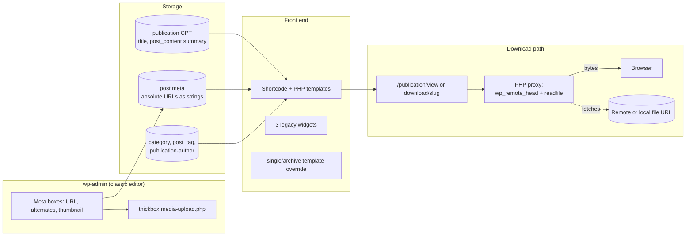
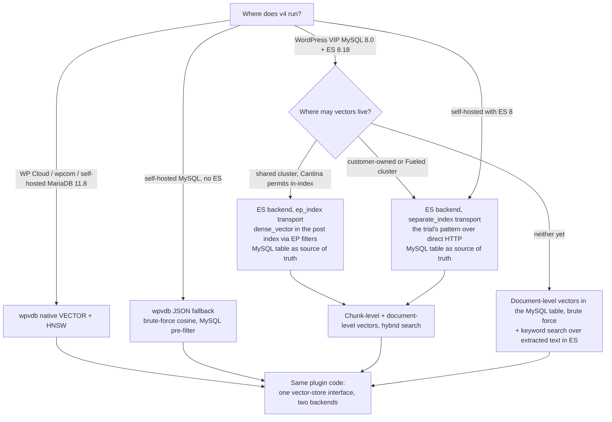
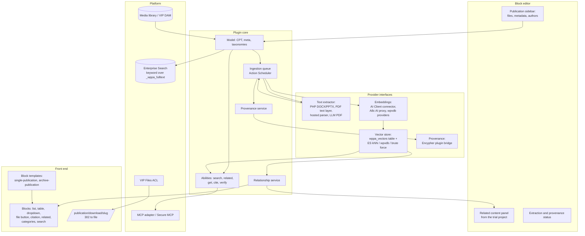
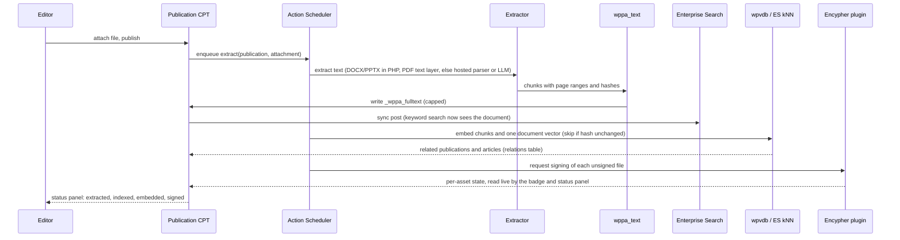
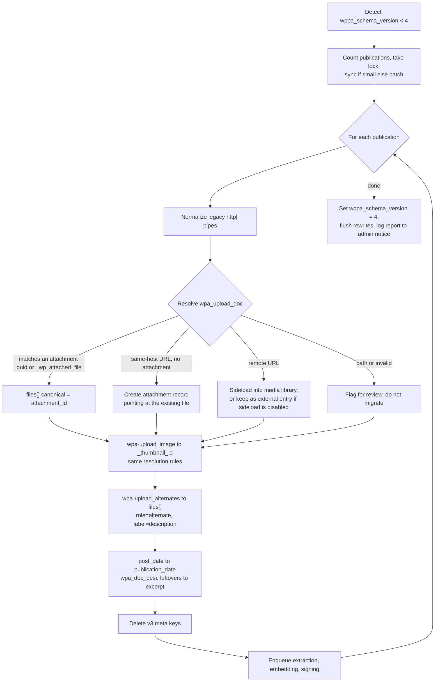

# WP Publication Archive: where it stands, and the case for a v4

Prepared 2026-09-20, revised 2026-09-21 with the trial code and the Cantina/Fueled findings. Working notes for Eric, not yet a product pitch. Uncommitted.

How this was put together: a line-by-line read of the 3.0.1 source (2,909 lines of PHP across 12 files), a sweep of the A8c Field Guide, VIP docs, VIP product and FDE P2s, Linear and GitHub, a read of the April trial P2, and external verification of WordPress 7.1, MariaDB, MySQL, Elasticsearch, ElasticPress, competitor plugins and Encypher. Slack was unreachable from the context tool during the research (permissions need reconnecting at mc.a8c.com/ai/context-a8c/), so nothing below is sourced from Slack. Where a claim rests on inference rather than a document, it says so.

---

## 1. Short version

**The current plugin is a 2013 file cabinet. It should not be ported. It should be replaced, with a one-way migration for the data.** The code lints on PHP 8.5 and would probably activate on WordPress 7.1, but its data model (absolute URLs in post meta instead of attachments), its delivery model (PHP proxies every download with `readfile()`), and its admin (thickbox uploader, classic meta boxes, legacy widgets) are all things a modern build would throw away. It also has an Author-level local file disclosure bug and a stored XSS. Getting it to "parity" is a two or three day patch that I would only do to protect the 400-odd installs still on wordpress.org.

**MariaDB is not an option on VIP.** VIP moved from MariaDB 10.3 to MySQL 8 in 2023 and runs 8.0.x today; there is no `VECTOR` type and no ANN index on that tier. MariaDB 11.8 with HNSW is fleet-wide on WP Cloud (WordPress.com, Pressable, Newspack), which matters for the wordpress.org audience but not for the VIP pitch.

**Enterprise Search is on Elasticsearch 8.18.2, which does `dense_vector`, HNSW kNN, nested kNN and RRF retrievers natively. No ES or ElasticPress upgrade is needed for vector search. The blocker on VIP is policy, not capability.** Cantina (VIP Platform, owner of the ElasticPress fork and the shared cluster) has said no to vector search on the shared multi-tenant cluster, and offers pointing Enterprise Search at a customer-owned vector-capable cluster instead. VIP product's answer to the "Vector Support for Enterprise Search" roadmap item is to partner with Fueled (ElasticPress / ElasticPress.io); whether that is a cluster swap or a plugin swap is an open question. The April trial (code now at `github.com/ericmann/acme-corp`, `plugins/acme-semantic`) ran kNN against ES 8.18.2 using a separate `dense_vector` index on its own host over direct HTTP, with vectors mirrored in a MySQL table so a reindex or purge never loses them. That is exactly the customer-owned-cluster path Cantina offers, so the trial already proved the pattern Cantina endorses; the in-index variant through ElasticPress filters is designed but untested. Meanwhile the ElasticPress "Documents" feature (attachment text indexing) is disabled on VIP, so no VIP customer can search inside a PDF today. That gap needs no vectors and is the most concrete thing this plugin can fix.

**Recommendation: build v4, but reposition it.** Not a document manager (VIP DAM is already doing that, is heading for the Integration Center, and would win). A *publications* layer: a scholarly identity for a document (authors, publication date, abstract, DOI, citation, license), full-text extraction and chunking so Enterprise Search and embeddings can see inside the file, semantic relationships between publications and between publications and articles, provenance on the file and its landing page delegated to the Encypher plugin, and blocks plus Abilities/MCP to surface all of it. Vectors live behind one small store interface with two backends: Enterprise Search kNN plus a MySQL redundancy table (the trial's pattern) on VIP, and wpvdb (Automattic's own native vector suite, which you already concluded in June should own that layer) on MariaDB hosts and everywhere else. That scoping keeps it out of the DAM's lane, reuses three things Automattic already owns (wpvdb, the AI Client, the AI proxy), and lines up with the exact customers in the roadmap commentary: Salesforce moving 10,000 PDFs, Pew, McKinsey, NASA, the White House.

The counter-argument, taken seriously in section 5.4: wpvdb-search already does "related posts" for any post type, WP Document Revisions already extracts PDF text and is free, and the DAM may grow a "document" flavour. What survives that argument is the combination of extraction-on-VIP, publication metadata, provenance, and an Integration Center packaging. That combination does not exist anywhere in the WordPress ecosystem, on VIP or off it.

---

## 2. Where the plugin stands

### 2.1 Inventory

| Area | State |
|---|---|
| Version / dates | 3.0.1, last tagged 2013, last commit Oct 2014 (two community bug fixes), 111 commits total |
| wordpress.org | Still listed, "400+" active installs, "Tested up to 3.6.1", no closure notice |
| Code | 2,909 lines PHP; one static god class (1,064 lines), an item wrapper, three `WP_Widget` classes, a 2002-vintage MIME lookup table, four PHP templates, one CSS file |
| Data model | CPT `publication` (supports title + editor), core `category` and `post_tag`, custom flat taxonomy `publication-author` (not queryable, no rewrite) |
| File storage | `wpa_upload_doc` = absolute URL string; `wpa-upload_image` = absolute URL string; `wpa-upload_alternates` = repeated meta of `{description, url}`; legacy `http|` pipe scheme still normalized on read |
| Delivery | `/publication/view/{slug}` and `/publication/download/{slug}` rewrite rules; PHP `wp_remote_head()` then `readfile($url)` to stream the bytes, or a 303 redirect if `wppa_mask_url` is filtered false |
| Front end | `[wp-publication-archive]` shortcode (list or dropdown), theme-overridable PHP templates, single/archive template overrides via `template_include`, three sidebar widgets |
| Admin | Three classic meta boxes; upload buttons open `media-upload.php?TB_iframe=1` and hijack `window.send_to_editor` |
| Search | A `posts_where_request` regex that rewrites the core search SQL to also match a `wpa_doc_desc` meta key |
| i18n | Text domain `wp_pubarch_translate`, POT from 2013, one de_DE translation |
| Tests, CI, build | None |

### 2.2 As-is architecture

### 2.3 Defects found in the read

Security (by code reading, not exercised):

- **Local file disclosure and SSRF, Author role and up.** The file URL is saved with `esc_url_raw()`, which passes anything beginning with `/` untouched. `open_file()` then calls `readfile()` on it after a `wp_remote_head()` whose failure is ignored. Any user who can publish a `publication` (capability type is `post`, so Authors qualify) can set the URL to `/etc/passwd` or the absolute path of `wp-config.php` and read it through the view endpoint. The same path lets them make the server fetch internal HTTP endpoints. `sslverify => false` on the HEAD request compounds it. (`lib/class.wp-publication-archive.php:264-341`)
- **Stored XSS.** Alternate-file descriptions are saved raw from `$_POST` and echoed unescaped on the single-publication page in `list_downloads()`. (`lib/class.wp-publication-archive.php:824`, `lib/class.publication-markup.php:398`)
- **Thumbnail `src` and title output unescaped** after passing through filters; low severity because the saved value is URL-escaped, but any filter can reintroduce a problem.

Correctness:

- **The search integration is dead twice over.** It regex-matches the WordPress 3.x search SQL shape, which core no longer produces (core now uses placeholder-escaped LIKE terms), and it targets `wpa_doc_desc`, a meta key the v3 upgrade routine moved into `post_content`. It also interpolates the raw search term into a regex pattern.
- **Rewrite collisions.** `^publication/view/...` and `^publication/download/...` are registered above the CPT's own rules, so a publication with the slug `view` or `download` is unreachable. Category archives are remapped by string replacement of `/category/` in every term link while the widget renders.
- **`ob_clean()` with no buffer** raises a notice on PHP 8 in both download paths.
- **`date()` instead of `wp_date()`** in author/date markup: ignores the site timezone and locale.
- **`the_content`, `the_title`, `publication_link` filter callbacks exist but are never hooked**; `get_link()` removes and re-adds a filter that was never added.
- `flush_rewrite_rules()` runs at plugin load on the upgrade path, and `add_option()` is attempted on every request for new installs.
- Off-by-one in the alternates loop (`<= count()`), patched once in 2014 to a different off-by-one.

Compatibility with 7.1 (see section 3 for the fix list):

- No `show_in_rest`, so no block editor, no REST, no DataViews, no block bindings. The plugin only works in the classic editor.
- 7.1 makes the iframed post editor mandatory for everyone; classic meta boxes still render, but the inline thickbox/`send_to_editor` JavaScript inside them needs verification in that context.
- `WP_Widget` classes work only through the Legacy Widget block and not at all in block themes.
- PHP templates using `extract()` and a global `$wppa_container`, which fail WordPress coding standards but still execute.
- The `allow_url_fopen` admin nag is irrelevant on any modern host and misleading on VIP, where the whole streaming model is wrong (see 4.3).

### 2.4 What still has value

- The CPT name `publication`, the URL structure `/publication/{slug}` and the `/publication/download/{slug}` endpoint have thirteen years of inbound links. Keep them.
- The `publication-author` taxonomy is the right idea (authors of a document are not WordPress users) and just needs to be public and REST-enabled.
- The 2013 class comment on `the_content()` says post content "will contain full-text references from the Publication itself to aid in full-text searching." That is the v4 thesis, twelve years late.
- The theme-override pattern for templates and the filter surface (`wppa_*`, `wpa-*`) tell you what integrators customized. Those hooks can be honoured as deprecated shims.

---

## 3. Absolute minimum for 7.1 parity (a 3.1 patch)

This is what it takes to make 3.0.1 safe and functional on WordPress 7.1.1 / PHP 8.3 without changing the data model. Roughly two to three days. I would ship it only as a stopgap for the wordpress.org installs, and I would not build v4 on top of it.

| # | Change | Why |
|---|---|---|
| 1 | Restrict the file URL to `http(s)` with a host, reject paths, and validate with `wp_http_validate_url()` before any fetch | Closes the local file read and most of the SSRF |
| 2 | Default `wppa_mask_url` to false (302/303 redirect) and keep proxying as opt-in with `wp_safe_remote_get()` streamed in chunks | Stops holding PHP workers; on VIP the proxy is the wrong model regardless |
| 3 | `sanitize_text_field()` on alternate descriptions; `esc_html()` / `esc_url()` / `esc_attr()` on every echo in the markup class and templates | Stored XSS |
| 4 | Remove the dead `posts_where_request` search filter, the `search_join`, `search_distinct` and the `allow_url_fopen` notice | Dead code that can only break things |
| 5 | Guard `ob_clean()` with `ob_get_level()`; replace `date()` with `wp_date()` | PHP 8 notices, timezone |
| 6 | Register meta with `register_post_meta()` and `show_in_rest`, add `show_in_rest => true` to the CPT and taxonomy, set `capability_type => 'publication'` with `map_meta_cap` | Block editor, REST, proper caps |
| 7 | Replace thickbox with `wp.media` in the three meta boxes (small JS file, enqueued on the edit screen only) | Thickbox compat mode is unsupported and untested in the 7.1 iframed editor |
| 8 | Add `show_instance_in_rest` to widgets; register a `menu_icon` dashicon; fix rewrite ordering so CPT slugs win | Legacy Widget block, admin polish |
| 9 | Rename text domain to `wp-publication-archive`, regenerate POT, add `Text Domain` and `Requires` headers, bump "Tested up to" | Directory hygiene |
| 10 | PHPCS + PHPStan baseline, a GitHub Action, and a WP-CLI smoke test that creates a publication and hits the endpoints | So the next change is not blind |

What parity does not buy: full-text search of documents, any semantic feature, block templates, provenance, or a sane admin. That is v4.

---

## 4. Platform landscape

### 4.1 Database: MariaDB vs MySQL

| Platform | Engine | Vector support | Source |
|---|---|---|---|
| WordPress VIP | MySQL 8.0.x (migrated off MariaDB 10.3, Feb to Jun 2023; last cited point version 8.0.28, Jan 2025) | None. `VECTOR` arrived in MySQL 9.0; `DISTANCE()` and any vector index are HeatWave-only through 9.7 | VIP lobby notice 2023-01-31; Field Guide "Node.js + MySQL for internal applications"; MySQL 9.7 reference manual |
| WP Cloud (WordPress.com, Pressable, Newspack) | MariaDB 11.8 LTS fleet-wide since June 2026 | `VECTOR(N)` + HNSW `VECTOR INDEX`, `VEC_DISTANCE_COSINE/EUCLIDEAN`, one vector index per table, column must be NOT NULL, InnoDB | radicalupdates P2 2026-05-21 and comment 2026-06-22; MariaDB 11.8 release notes |
| Self-hosted | Either | Depends on host | |

Custom tables are permitted on VIP (`$wpdb->prefix`, `dbDelta()`, indexes justified by queries, caching expected). The CREATE/DROP prohibition only applies to `wp db query` over VIP-CLI. No VIP discussion of adding MariaDB or vectors to the database tier was found.

Conclusion: an in-database vector index is available to the wordpress.org and WP Cloud audience and not to VIP. Any design has to work with a brute-force or external-index fallback on VIP.

### 4.2 Enterprise Search

- Fork of ElasticPress plus a forked `es-wp-query` in `vip-go-mu-plugins`, owned by VIP Platform: Cantina. Elasticsearch, not OpenSearch.
- Upgraded from ES 7.17.8 to **8.18.2**, all production by January 2026. ES 8.18 supports `dense_vector` and HNSW kNN natively. There are zero references to `dense_vector` or `knn` in `vip-go-mu-plugins`.
- Customer mapping and query filters work (`ep_post_mapping`, `ep_formatted_args`, `ep_set_sort`, `vip_search_post_meta_allow_list`). Adding a `dense_vector` field via `ep_post_mapping` on 8.18 is plausible and unsupported. Cantina's stated position (March 2026 thread on Fueled's ElasticPress upgrade request): no AI/ML on the shared cluster; an option to point Enterprise Search at a customer's own vector-capable ES cluster exists.
- Roadmap: "Vector Support for Enterprise Search" is listed in the August 2026 Director's Commentary behind the edge-control ladder, with no Linear project yet. The VIP DAM update of 2026-09-11 says its own kNN search is "blocked on the WordPress AI Client shipping an embedding-generation call."
- Hard limits that matter here: the **Documents feature (attachment text via ingest-attachment) is disabled**, along with Autosuggest, Comments and Instant Results; 10,000-result window; 510-character search terms; no public ES endpoint; index and query rate limits.
- 10up's ElasticPress Labs 2.5 (Nov 2025) ships kNN, kNN-cosine and hybrid kNN+BM25 plus AI summaries, using the customer's OpenAI-compatible key. It is not on VIP.

Update 2026-09-21, from Jacob Smith (VIP product): the "Vector Support for Enterprise Search" roadmap item means partnering with Fueled (d.b.a. ElasticPress / ElasticPress.io). Cantina has said no to running vector search on the shared cluster. The roadmap item has no Linear project. Jacob's phrase "the Elasticsearch version that supports vector embedding" paraphrases the Cantina position and is not a version constraint: 8.18.2 already supports everything needed. Inferred, not confirmed: "partner with Fueled" most likely means ElasticPress.io as a hosted vector-capable cluster plus ElasticPress Labs 2.5 (kNN, kNN-cosine, hybrid kNN+BM25, customer's own OpenAI-compatible key); whether it is an ES-side cluster swap or a plugin-side swap of the EP fork is the open question. Cantina's "AI/ML" is Elastic's marketing category, not a claim about what code runs; the real objection is operational: HNSW graph memory resident per shard, heavier indexing and segment merges, reindex semantics (vectors must be regenerated or restored), and latency variance on filtered kNN with high `num_candidates` on a multi-tenant cluster.

Conclusion: keyword search over extracted text needs no platform change, no vectors and no decision from Cantina, and is the day-one win. Vector search has two shapes, ranked:

- **In-index.** Add a `dense_vector` field to the existing post index via `ep_post_mapping`, populate it via `ep_post_sync_args`, and query with a `knn` clause via `ep_formatted_args` (hybrid with BM25 in the same request). No new index. A VIP-triggered reindex repopulates vectors from the MySQL table at no embedding cost to anyone. Chunk-level vectors fit as a `nested` field with nested kNN. This variant asks Cantina for nothing but a mapping change and it is the one to lead with on the shared cluster. It is designed against ElasticPress's public filter surface and has not been exercised on VIP's fork.
- **Separate index.** A dedicated vector index on a cluster the site controls, over direct HTTP. This is what the trial built and ran. On the shared cluster it is a customer-owned index, which Cantina has declined; on a customer-owned cluster, a Fueled/ElasticPress.io cluster or self-hosted ES it is the natural transport, and it becomes the VIP path the moment VIP points a site at a partner cluster.

Either way the MySQL table is the source of truth and the ES index is a rebuildable projection. Embedding generation is a separate concern from ANN storage: vectors can be produced off-cluster (customer key, Automattic AI proxy, or a partner's provider), which is the part of the workload Cantina was not objecting to. The v4 backend is therefore cluster-agnostic: one mapping and one kNN query, two transports selected by configuration, ElasticPress filters detected at runtime rather than assumed.

### 4.3 Files and delivery

- VIP File System is an object store mounted at `wp-content/uploads` through a PHP stream wrapper; containers are read-only apart from per-request `/tmp`; ~200 ms per filesystem call; no `scandir`/`glob`; 4 GB per file; 300 s web request ceiling; transfers under 256 KiB/s for 30 s are aborted.
- Nothing prohibits a plugin proxying bytes through PHP, but it holds a worker and hits those ceilings. The right model is a redirect or direct URL to the CDN-backed file.
- Protected downloads: **Access-Controlled Files** (restrict unpublished, or restrict all; enabled by VIP Support; ~10 to 15% slower; 404 for unauthorized). VIP DAM uses this for file-layer embargo. That is the supported way to do "members-only" publications on VIP.
- PHP `memory_limit` 768 MB, which bounds in-process PDF parsing.

### 4.4 AI and embeddings

Three things exist, at different maturity:

1. **WordPress AI Client (core since 7.0)**, `wp_ai_client_prompt()` and the Connectors screen (OpenAI, Anthropic, Google). Text generation is in core. **Embeddings are not wired yet**: tracked in WordPress/ai #962, milestone 1.4.0, storage and similarity utilities merged in the AI plugin, listed for the 7.2 cycle. VIP's product direction is bring-your-own-key through Connectors, and VIP DAM already uses the AI Client for alt text.
2. **Automattic AI API Proxy** (`public-api.wordpress.com/wpcom/v2/ai-api-proxy/v1/`): gateway to OpenAI, Anthropic, Vertex and internal Ray Serve models; embedding endpoints for `nomic-embed-text-v2-moe` (768d) and `nomic-embed-vision-v1.5`; feature tokens via #ai-ops; no per-site quota documented. This is the "included" provider for an Automattic-owned plugin.
3. **wpvdb** (Automattic/wpvdb, wpvdb-search, wpvdb-smart-search, wpvdb-blocks; Ramon Corrales and Esteban Cairol, WP Cloud/Newspack): native `VECTOR` on MariaDB 11.7+ with HNSW, JSON fallback with PHP cosine on anything else, SQLite for Playground. Providers: OpenAI, AI proxy (Nomic), Voyage, custom endpoints. Chunking, Action Scheduler queue, model-mismatch detection, pre/post filtering by post type/taxonomy/author/date. `WP_Query` arg `vdb_vector_query`, `Search::run()` with dense/sparse/hybrid (RRF), `Search::related_to_post()`, Abilities `wpvdb/semantic-search` and `wpvdb/find-related-posts` already MCP-public. Measured on a 100k-post corpus: NDCG@10 0.867 (OpenAI small) vs 0.749 (Nomic); db p95 28 to 60 ms on MariaDB; end-to-end p95 dominated by the query-embedding network hop. Status: experimental, "not yet a managed plugin," pilot proposed with publishers.

Your own June 23 journal note reached the conclusion I would also reach for MariaDB hosts: vector storage and retrieval are owned by wpvdb; do not rebuild them. On VIP the picture is different because ES 8.18 is there and wpvdb's only option is its JSON fallback, which is brute-force cosine in PHP. Rough sizing for 768-dimension vectors: about 10,000 stored vectors costs on the order of 100 to 300 ms per query in PHP; 100,000 costs seconds. That is fine for a 2,000-document archive with document-level vectors and not fine for chunk-level search over a Salesforce-scale corpus. ES kNN handles both at any size the cluster tolerates.

The trial project (April 2026, `github.com/ericmann/acme-corp`, `plugins/acme-semantic`) is the working precedent: Voyage `voyage-4` at 1024d with `input_type` document/query asymmetry and a five-attempt retry that honours `Retry-After`; a per-site MySQL table (`post_embeddings`, packed float32 blobs, content hash for skip) as source of truth; a separate ES 8 `dense_vector` index on its own host, written through `_bulk` and queried with `knn` over direct HTTP, never through ElasticPress; three search modes with an RRF merge that also demotes keyword-only hits whose cosine to the query is under 0.5; a related-content REST route that resolves the query vector from draft text, then the stored vector, then prepared text; and a Gutenberg sidebar with a four-second idle debounce and a sixty-second throttle. All of that is specified for porting in `V4_SPEC.md`. What changes is the interface above it, so the same plugin code runs on wpvdb where MariaDB exists and on either Elasticsearch transport elsewhere.

### 4.5 Integration Center

Launched June 2025. Current listing: Airtable, Block Data API, Block Governance, Enterprise Search, Generic HTTP, Google Sheets, New Relic, Parse.ly, Real-Time Collaboration (beta), Remote Data Blocks, Shopify, TollBit, plus Secure MCP, Answers Agent, Safe Publish, Security Boost, Jetpack. **No DAM or document library partner is listed today**; Cloudinary, Tenovos and Brightcove were "planned" in the 2024 Seamless Integrations plan.

Mechanics: GOOP (vip-go-api) holds the record, config is injected as a single constant, code ships platform-wide via `vip-go-mu-plugins-ext` and is loaded by the integrations loader. Enabling delivers config, not code, and activation hooks never fire (so v4's upgrade routine must be lazy and idempotent, not activation-driven). Intake as of August 2026: Keystone listing agreement, `npx @automattic/vip-integration init` starter kit with PHPUnit and Playwright, `vip-integration validate` and a `vip-manifest.yaml`, VIP security review, platform prep from the manifest, marketing listing. Baseline WP 7.0, PHP 8.2 to 8.5. Owners: Patisserie (SDK), Jacob Smith (product), Cantina (loading), #vip-product-integrations. VIP DAM is going through exactly this path and reports the mu-plugins mount path "still unproven" as of 2026-09-18, so a second first-party integration would ride behind it and benefit from the trail it clears.

### 4.6 Provenance

- C2PA 2.4 (April 2026) and the Deployment Guidance 1.0 (July 2026) cover PDF and Office containers via JUMBF and add text regions of interest. EU AI Act Article 50 transparency obligations have applied since 2026-08-02.
- Encypher: text provenance over the C2PA Text Embedding standard (Unicode variation-selector embedding with signed manifests). Free WordPress plugin that signs on publish and bulk-signs archives; Python SDK, REST API, CLI; **no PHP or JS SDK**; core is AGPL-3.0 with commercial licensing; Starter $99/month for 10k signs, up to Enterprise. You already own the FDE workstream on this (July 7 Integration Center evaluation, July 15 comparison of IPTC signer / Encypher / wp-c2pa PoC / Photon, July 24 native-C2PA-on-derivatives proposal, Pew suggested as pilot).
- WordPress core neither reads nor writes C2PA (WordPress/ai #421). The IPTC C2PA Signer handles images and video. Nobody handles PDFs or document landing pages in WordPress.

### 4.7 Vector backend decision

Reading: MariaDB is the best case and it exists in the Automattic fleet, just not on VIP. Elasticsearch kNN is the VIP answer and it works on 8.18.2 today; the gate is Cantina policy on the shared cluster, and the two transports cover both outcomes (in-index if they permit it, separate index on whatever cluster VIP or the customer provides if they do not). Nothing here requires a platform change or an upgrade to ship a useful v4 on VIP.

---

## 5. Is it worth building?

### 5.1 What exists today

| Product | Extracts PDF/DOCX text | Semantic search | Provenance | Runs on VIP | Notes |
|---|---|---|---|---|---|
| WP Document Revisions (free, 5.4.2, tested to 7.1.1) | Yes | No (AI revision summaries via AI Client) | No | Not vetted | Closest open-source analogue; workflow/versioning focus |
| Document Library Pro (Barn2, $149 to $599/yr) | Yes, Advanced tier, no OCR | No | No | Not vetted | Table/grid UI, the consumer-market leader |
| WordPress Download Manager, WP File Download, FileBird, PDF Embedder | Mostly no | No | No | Not vetted | File managers and viewers |
| SearchWP / Relevanssi Premium | Yes (Xpdf / hosted Tika) | No | No | Relevanssi replaces WP search, conflicts with ES | Keyword only |
| WPSOLR | Via engine | Yes (Weaviate, pgvector, Algolia Neural, Vespa) | No | External engine required | The only vector option, and it is bring-your-own-engine |
| ElasticPress Labs 2.5 | Yes (Documents feature) | Yes (kNN, hybrid) | No | Documents disabled, Labs not deployed | What VIP ES would look like if the roadmap item lands |
| Jetpack Search / AI Search | Not documented | AI answers, hybrid index behind a sticker | No | Coming to VIP in 16.2 (AI features), search not | wpcom-side |
| wpvdb suite (Automattic, experimental) | No (post content only) | Yes | No | JSON fallback | The storage layer, not a product |
| VIP DAM (in-house, Chris Dixon, v4.0.2, Integration Center) | No (AI alt text only) | Blocked on AI Client embeddings | No | Yes | Folders, rights, embargo, versioning, 47 Abilities, ES routing |

No product in that table does full-text extraction plus semantic relationships plus provenance for documents, and none of the ones that do extraction run on VIP.

### 5.2 VIP DAM, specifically

The DAM is the elephant. It ships as an Integration Center integration, it already has folders, rights and embargo, versioning, duplicate detection, hub-and-spoke federation, Enterprise Search routing, and 47 Abilities. If v4 is "upload a file, list it, download it," the DAM eats it and should.

The DAM does not do, and by its feature list does not plan to do: document text extraction, per-document scholarly metadata, chunk-level or document-level embeddings, publication-to-article relationships, citation output, landing pages as first-class content, or provenance signing. Its "searchable AI text floor" is alt-text-shaped. DAM assets are ordinary WordPress attachments (confirmed with Eric, 2026-09-20), so the right relationship is that a Publication *references* an attachment ID, which is a DAM asset where the DAM is installed and a plain media item where it is not, and adds the layer the DAM does not have. That also means v4 gets rights and embargo for free where the DAM is installed.

### 5.3 Demand signals (from the August Director's Commentary and FDE P2s)

- Salesforce ($890K): migrating 10,000 PDFs.
- McKinsey: a 200-page rules PDF as a driving use case.
- Pew Research: PDF to Gutenberg ingestion pipeline already built by FDE with Gemini Flash; Pew is also the suggested C2PA pilot.
- NASA, White House, Sealed Air, Ziff Davis, City of Philadelphia: DAM replacements, which is the DAM's lane, but every one of those is a publications-heavy organization.
- NBCU, MediaNews, Pew asked Cantina for semantic search on Enterprise Search.
- "Digital Asset Management enters discovery against $8.2M of requesting accounts."
- The trial project's own thesis (semantic layer improves search-to-pageview and editor reuse time) got a yes from Jake on the narrative and no pushback on the architecture.

### 5.4 Verdict

Build it, with the repositioning. The honest case against:

- **wpvdb-search already does related posts for any post type.** True, and v4 should call it rather than reimplement it. What wpvdb does not do is get text out of a PDF, and without that the vectors are built from a two-line summary.
- **WP Document Revisions extracts text for free.** It does, into a workflow-centric plugin nobody would put through VIP review, with no semantic layer and no provenance.
- **The DAM could add a "document" type.** It could. It has bigger fish, its team is blocked on the same AI Client embedding call, and a publications layer that consumes DAM assets is additive to their roadmap, not competitive. Worth a conversation with Chris Dixon before pitching product, and the pitch is stronger with him in it.
- **Vector search on the shared VIP cluster depends on Cantina policy, not capability.** If they hold the line, the separate-index transport runs on a customer-owned or Fueled cluster (the path they themselves offer), and section 4.4 sizes the brute-force floor for sites with neither: document-level relationships work at any archive size, chunk-level semantic search does not. The keyword-over-extracted-text win needs no vectors at all and is available to every VIP customer the day it ships.

What makes it not a vanity project is that the customers are named, the gap (no way to search inside a document on VIP) is verifiable, the platform pieces exist and are Automattic-owned, and you already hold the provenance workstream it would attach to. What would make it one is scope creep back into file management. Keep the DAM as the bytes layer and stay above it.

### 5.5 A real v4, or a purpose-built successor?

The question that decides the shape of the build: is this WP Publication Archive 4.0, which any WordPress site can install and which upgrades v3 data, or a new VIP-only plugin that shares a lineage and nothing else?

Start with who would upgrade. Every v3 install is a wordpress.org site (400-odd, many probably dormant). No VIP customer runs v3; the platform would never have passed `readfile()` proxying. So the upgrade path serves the public audience exclusively, and a VIP customer is a fresh install in either model. The two audiences are disjoint, and "upgrade or not" is really "carry the public audience or not."

| | Real v4 (standalone, DAM-optional) | VIP-only successor |
|---|---|---|
| Asset source | Media library; VIP DAM as a picker and rights layer when present | VIP DAM required |
| Vector backend | ES kNN on VIP, wpvdb elsewhere, JSON brute force as floor | ES kNN only |
| Delivery / ACL | Redirects; Files ACL on VIP, signed URLs elsewhere | Files ACL only |
| Upgrade from v3 | Yes, forced one-way migration on first load | No; v3 gets the 3.1 patch and is closed |
| Distribution | wordpress.org + Integration Center listing (the wp-parsely model) | `vip-go-mu-plugins-ext` only |
| Test population | Public installs plus WP Cloud sites with MariaDB-native vectors | Zero until the first FDE install |
| Support obligation | wordpress.org forum, public issues | VIP support only |
| Coupling risk | Provider interfaces to maintain | Hostage to DAM timeline and the unproven mount path |
| WordPress.com story | Yes: same plugin, native HNSW on MariaDB 11.8 | None |

The successor model is only compelling if the DAM is a true foundation rather than an asset source. It is not. A publication references an attachment ID, and DAM assets are ordinary WordPress attachments with extra meta, so the DAM is a richer picker plus rights and embargo that the plugin honours when it finds them. That is an adapter, the same shape as the ES backend and the Files ACL hook. Making it a hard dependency buys nothing except a smaller support matrix, and costs the entire non-VIP audience.

The upgrade itself is not what makes this hard. It is a forced, automatic meta migration from URL strings to attachment IDs, with sideloading for remote files and a review flag for anything unresolvable: two or three days inside a ten-week build, and cheap insurance for the credibility of a "v4" label on wordpress.org. The bar is "no upgraded site breaks," not "old data formats keep working." v4 never reads v3 meta at render time.

The precedent is wp-parsely: a public plugin on wordpress.org that is also an Integration Center listing, with VIP-specific behaviour behind injected config. wpvdb, Remote Data Blocks and Block Data API are all public repositories too. VIP does not require exclusivity to list an integration, so the public release and the Integration Center listing are packaging of one codebase, not two products.

Verdict: build it as a real v4. One plugin, three optional adapters (DAM, ES kNN, Files ACL), one explicit upgrade. The only reason to choose the successor is if product wants a VIP-exclusive name and no public support burden; that is a legitimate call for them to make, and it should be made knowing it forfeits the WordPress.com story and the dogfooding population.

---

## 6. What v4 looks like

Working name: keep "WP Publication Archive" on wordpress.org for continuity; "VIP Publications" for the Integration Center listing.

### 6.1 Positioning

A publication is a document with a public identity: authors, a publication date that is not the post date, an abstract, a document type (report, brief, white paper, dataset, transcript), a license, optional DOI/ISBN, a canonical file plus alternates (translations, accessible versions, datasets), a landing page, a citation, extracted text, embeddings, relationships to other publications and to articles, and a provenance record. The plugin owns the identity and the derived data. The bytes live in the media library or the DAM. Search lives in Enterprise Search (keyword, and kNN where the cluster is available) and wpvdb (semantic on MariaDB hosts). Every platform-specific piece is an adapter; the plugin runs on a plain media library with brute-force vectors and gets better as each adapter finds its platform.

### 6.2 Data model

| Object | Storage | Notes |
|---|---|---|
| Publication | CPT `publication`, `show_in_rest`, block editor, `capability_type => 'publication'` with `map_meta_cap`, supports title, editor (the abstract/summary), excerpt, thumbnail, revisions, custom-fields, author | Slug and archive preserved |
| Files | Registered array meta `_wppa_files` of `{attachment_id, role: canonical|alternate|dataset|accessible, label, language, checksum}` with a REST object schema | Attachment IDs, never URLs. External URLs allowed only as `{url, role}` entries flagged `external`, never proxied |
| Thumbnail | `_thumbnail_id` | Standard featured image |
| Authors | `publication-author` taxonomy made public and REST-enabled, term meta for ORCID and affiliation | Optional link to a WP user |
| Metadata | Registered scalar meta with schemas: `publication_date`, `document_type`, `publisher`, `doi`, `isbn`, `license`, `language`, `page_count`, `citation_override` | All bindable via Block Bindings |
| Extracted text | Custom table `{prefix}wppa_text`: `id, publication_id, attachment_id, chunk_index, page_start, page_end, text, text_hash, extractor, extracted_at` | Chunked (target ~500 tokens, sentence-aligned). A concatenated, size-capped copy is also written to a registered meta `_wppa_fulltext` so Enterprise Search indexes it without custom mappings |
| Embeddings | Source of truth: `{prefix}wppa_vectors` (`chunk_id, model, dims, vector BLOB, updated_at`), the trial's redundancy table. ANN index: ES `dense_vector` on VIP and other ES hosts, wpvdb on MariaDB hosts, brute force over the table as the floor | The table exists so an ES reindex or purge never costs an embedding run; wpvdb is fed from it rather than duplicating provider logic |
| Relationships | Custom table `{prefix}wppa_relations`: `from_id, to_id, type: cites|related|supersedes|translation_of|derived_from, score, source: manual|semantic|import` | Semantic rows are rebuildable; manual rows survive re-indexing |
| Provenance | None of ours. Read live from the Encypher plugin's per-asset meta through a bridge class; `_wppa_ingest_status.sign` records only whether a signing request was handed off | The plugin signs nothing and calls no signing API |
| Download events | Optional table `{prefix}wppa_downloads` or Parse.ly/analytics hook | Off by default on VIP; use the analytics integration |
| Schema version | Option `wppa_schema_version` | Drives the lazy upgrader |

### 6.3 Architecture

### 6.4 Ingestion pipeline

Extraction choices, in order of preference: DOCX/PPTX/ODT in PHP with `ZipArchive` plus a light XML walk (PHPWord and PHPPresentation are the maintained heavier options); PDF with a text layer via `smalot/pdfparser` (limited maintenance, no encrypted files, no OCR) inside a memory guard; scanned or complex PDFs via a hosted parser (Unstructured at $0.015/page, LlamaParse from about $0.001/page, Textract at $0.0015/page) or an LLM with native PDF input (Gemini does not charge for extracted text tokens; Claude and OpenAI bill text plus page images). On VIP the file is read through the stream wrapper, so read it once into `/tmp` and parse from there. The extractor is a provider interface so FDE engagements like Pew's Gemini pipeline drop in.

### 6.5 Search and relationships

- **Keyword**: `_wppa_fulltext` is added to the VIP meta allow-list and weighted via `ep_formatted_args`; the archive search block queries `post_type=publication`. This is the day-one VIP win and needs no vectors.
- **Semantic**: one `VectorStore` interface (`upsert`, `delete`, `query(vector, filters, k)`, `related(post_id, k)`) with three implementations. On VIP and any ES 8 host: kNN against `dense_vector` in the post index, hybrid with BM25 in the same request, filters via the standard EP `post_type`/taxonomy clauses. On MariaDB hosts: `wpvdb-search` `Search::run()` and `Search::related_to_post()`, with `Search::post_ids()` hydrating our `WP_Query`. Floor: cosine over `wppa_vectors` in PHP with a MySQL pre-filter. The related-articles side hooks `posts_pre_query` so a "Related publications" block works on any post type.
- **Cross-type relationships**: nightly job computes publication-to-article neighbours above a threshold into `wppa_relations`; editors can pin or dismiss; the sidebar panel from the trial project shows them while writing.
- **ES backend details**: cluster-agnostic, two transports. `ep_index`: mapping via `ep_post_mapping` (document vector as `dense_vector`, chunk vectors as a `nested` field), population via `ep_post_sync_args` reading `wppa_vectors`, query via `ep_formatted_args` adding `knn` (nested kNN for chunks), ElasticPress presence detected at runtime. `separate_index`: the trial's direct-HTTP implementation against a configured host (customer-owned, Fueled/ElasticPress.io, self-hosted). A reindex regenerates nothing on either transport; it re-reads the table. Query-embedding of the user's search term is one provider call per request (the trial measured this hop as the dominant latency), cached by term hash for a short TTL.

### 6.6 Delivery and access

- No proxying. The canonical file button links to the attachment URL (CDN on VIP). `/publication/download/{slug}` and `/publication/view/{slug}` stay as 302 redirects for inbound links, with an optional `Content-Disposition` variant on hosts that allow `X-Sendfile`/`X-Accel-Redirect`.
- Restricted publications use VIP Files ACL "restrict unpublished" (draft documents are 404 at the edge) or "restrict all" with a capability check; on other hosts, a signed short-lived URL from a REST endpoint.
- Download counting is a `navigator.sendBeacon` from the Interactivity API to a REST endpoint, batched, off by default.

### 6.7 Front end and admin

- Blocks (dynamic, PHP-registered with `autoRegister`, Interactivity API for filtering and pagination): Publication List, Publication Table (DataViews-style with facets), Publication Dropdown, Publication File (button with icon, size, language), Citation (APA/Chicago/BibTeX via a filter), Related Publications, Publication Categories, Publication Search (keyword/semantic/hybrid toggle). Block Bindings expose every registered meta to core Paragraph/Heading/Image/Button.
- Block templates via `register_block_template()` for `single-publication` and `archive-publication`; theme overrides win; classic themes fall back to the PHP templates rewritten without `extract()`.
- `[wp-publication-archive]` remains as a wrapper that renders the List block with mapped attributes. `wppa_*` filters kept as deprecated shims for two releases.
- Editor: one sidebar panel (`PluginDocumentSettingPanel`) for files (via `wp.media` or the DAM picker when present), metadata and authors; a status panel for extraction, indexing, embedding, signing with re-run buttons; the related-content panel.
- Admin list: keep the classic table (CPTs are still `WP_List_Table` in 7.1), add columns for file type, page count, provenance status, and a "Publications" DataViews page under the CPT menu for bulk re-index/re-sign.
- Schema.org `ScholarlyArticle`/`Report` JSON-LD on the landing page; `citation_*` meta tags for Google Scholar.

### 6.8 Abilities and MCP

Registered on `wp_abilities_api_init`, `meta.mcp.public` where safe: `publications/search` (keyword|semantic|hybrid), `publications/related` (by publication or by any post), `publications/get` (metadata, files, citation, provenance), `publications/cite`, `publications/verify-provenance`, `publications/ingest` (privileged: create a publication from an uploaded file, run extraction, draft abstract with the AI Client). That set makes the archive usable by Secure MCP, the Answers Agent, and any agent workflow the FDE team builds.

### 6.9 Provenance

Delegated entirely to the Encypher WordPress plugin. v4 does not sign, hash for provenance, bundle C2PA libraries or call Encypher's API; the wp-c2pa extension stays a proof of concept and is not part of this design. What v4 adds is a bridge: detect the plugin, ask it (through its own action) to sign a publication's files when the publication is published or its files change, add `publication` to the post types whose content it signs so the landing-page abstract is covered, and read its per-asset state live into a Content Credentials badge block, a list-table column, the editor status panel and a `verify` Ability. Every Encypher symbol the bridge touches is a config key with a guard, so the integration survives plugin changes without a release. When the plugin is absent, every provenance surface disappears and the ingest `sign` step is recorded as skipped.

### 6.10 Upgrade from v3

Forced, one-way, idempotent, resumable. v4 does not read v3 meta at render time, so the migration runs before anything else does: a lazy upgrader on `init` (guarded by the schema-version option and a lock, because Integration Center delivery never fires activation hooks) migrates synchronously when the archive is small, roughly under 200 publications, and otherwise schedules batches through Action Scheduler and finishes within minutes. `wp publications upgrade` runs the same routine on demand with a report. During a batched window, unmigrated publications render with an empty file list rather than an error; nothing 500s, and every URL keeps resolving.

Guarantees: no publication is deleted or unpublished; every publication ends with either a migrated files array or a review flag (the file is unreachable but the landing page renders and the admin notice lists it); URLs for landing pages and download endpoints are unchanged; the old shortcode and the `wppa_*` filters keep working through shims for two releases. Non-guarantees, deliberately: v3 meta keys are removed once a publication is migrated, there is no rollback command, and going back to 3.x means restoring a database backup. The wordpress.org readme says so in the upgrade notice.

---

## 7. Phasing

| Phase | Scope | Rough effort (one engineer, agentic loops) | Outcome |
|---|---|---|---|
| 0 | 3.1 stopgap patch (section 3) | 2 to 3 days | wordpress.org installs safe; buys time |
| 1 | New plugin skeleton, data model, upgrader, blocks, block templates, shortcode shim, redirects, Files ACL, PHPUnit + Playwright, VIP starter kit layout | 3 to 4 weeks | A modern archive with no AI; releasable on wordpress.org and as an FDE-installed plugin |
| 2 | Extraction pipeline, `_wppa_fulltext` into Enterprise Search, `wppa_vectors` table and ES kNN backend ported from the trial code, wpvdb backend, related panel, Abilities/MCP | 3 to 4 weeks | "Search inside the PDF" and semantic relationships on VIP; MariaDB-native on WP Cloud; MCP surface |
| 3 | Encypher plugin bridge, citation and Scholar tags, DAM asset picker and rights hook, Integration Center manifest and listing | 3 to 4 weeks plus review cycles | Integration Center candidate; pilot with Pew |

Phase 1 alone is worth doing for the wordpress.org audience. Phase 2 is the VIP pitch. Phase 3 is where it becomes unlike anything else.

---

## 8. Risks and open questions

- **DAM overlap** is the political risk. Talk to Chris Dixon before product. The pitch should be "Publications consumes DAM assets" with a demo that shows both.
- **AI Client embeddings** are not in core yet (AI plugin 1.4.0, 7.2 cycle). Until then the embedding provider is the A8c AI proxy (needs a feature token from #ai-ops) or a customer key via wpvdb's providers. BYO-key is VIP's stated direction; design for both.
- **Vectors on the shared ES cluster are a Cantina policy decision.** The in-index transport asks for the least (a mapping change, a reindex that re-reads MySQL). If they decline, the separate-index transport runs on whatever cluster VIP or the customer provides, and brute force covers the rest. The numbers Cantina actually cares about, to bring to Rinat before any product pitch: vector dimensions, vector count per site, shard memory delta, p95 filtered-kNN latency at the chosen `num_candidates`, and the reindex-cost argument (vectors are restored from MySQL, never regenerated). Frame it as "please support this pattern," not "please build it."
- **Open threads (not tasks):** confirm the March 2026 Cantina thread says what section 4.2 records; ask Jacob whether the Fueled plan is ES-side or plugin-side; the Rinat thread above.
- **Extraction cost and quality** for scanned PDFs need a hosted parser and a budget; pure PHP is text-layer only. On VIP, 768 MB memory and the 300 s ceiling mean extraction always runs in the queue, never in the request.
- **Provenance depends on the Encypher plugin's hooks.** Its detection symbol, meta keys and sign action are not public and were assumed; they are config keys, and the scaffold step reads the real plugin when it is available. Licensing (the plugin is GPL, the service is commercial, enterprise from $50k/yr per the August call) is a customer-side matter, not ours.
- **Integration Center mount path** is unproven even for the DAM as of 2026-09-18; we ride behind them.
- **Trial code** was read for this revision (`github.com/ericmann/acme-corp`, private). `V4_SPEC.md` names the functions to port and tells the human to copy the plugin into `docs/reference/` before flying, since the build runs unattended and cannot reach a private repository.
- **Unverified**: whether classic meta box thickbox JS still functions in the 7.1 iframed editor (moot for v4); the exact current MySQL point version on VIP (8.0.28 as of January 2025 is the last citation); MariaDB's maximum vector dimension (docs say 16,383 on one page and 65,532 on another); anything that lives only in Slack.
- **Not researched**: multisite and hub/spoke behaviour (the DAM has federation; publications across a network is a likely ask from the news customers), and Parse.ly integration for download analytics.

---

## 9. Sources

Internal

- VIP database migration notice, 2023-01-31: https://customerhub.wpvip.com/lobby/2023/01/31/notice-database-upgrades-beginning-february-6th/
- Field Guide, Node.js + MySQL for internal applications (MySQL 8.0.28 citation): https://fieldguide.automattic.com/vip-team/vip-customer-success/vip-support/vip-technical-information/node-js-apps-on-vip-go/node-js-mysql-for-internal-applications/
- Field Guide, Configuring MySQL on VIP Go: https://fieldguide.automattic.com/vip-go/configuring-mysql-on-vip-go/
- Field Guide, VIP Search handbook and filters: https://fieldguide.automattic.com/vip-team/vip-engineering/vip-go-elasticsearch-handbook/vip-search/
- Field Guide, Seamless Integrations: https://fieldguide.automattic.com/vip-seamless-integrations/
- Field Guide, AI API Proxy endpoint: https://fieldguide.automattic.com/ai-api-proxy-endpoint/
- Elasticsearch 8 on VIP, 2025-07-17: https://customerhub.wpvip.com/lobby/2025/07/17/elasticsearch-8-coming-to-wordpress-vip-in-october-2025/
- VIP Roadmap Director's Commentary, 2026-08-21: https://vipproductp2.wordpress.com/2026/08/21/vip-roadmap-directors-commentary/
- ElasticPress upgrade request from Fueled, 2026-03-09 (vipproductp2); Elastic Search AI integration AMA, 2025-10-07 (vipama)
- VIP DAM feature list, 2026-09-02: https://vipfde.wordpress.com/2026/09/02/vip-digital-asset-manager-the-feature-list/ and Linear project (CMS) VIP DAM
- Pew PDF ingestion, 2026-02-23: https://vipfde.wordpress.com/2026/02/23/pew-ai-agent-workflows-markdown-pipeline-and-pdf-ingestion-progress/
- Encypher for the Integrations Center, 2026-07-07: https://vipfde.wordpress.com/2026/07/07/encypher-for-the-integrations-center-c2pa-media-provenance-for-vip-customers/
- Integration SDK workflow for partners, 2026-07-29: https://teampatisseriep2.wordpress.com/2026/07/29/wordpress-vip-integration-sdk-workflow-for-partners/
- Native vector search on WP Cloud, 2026-04-18 and 2026-05-21: https://radicalupdates.wordpress.com/2026/04/18/native-vector-search-on-wp-cloud/ , https://radicalupdates.wordpress.com/2026/05/21/layered-native-vector-search-on-wp-cloud-and-beyond/
- wpvdb repos: https://github.com/Automattic/wpvdb , wpvdb-search, wpvdb-smart-search, wpvdb-blocks
- Trial P2 (14 posts, April 13 to 17, 2026): https://ericmanntrialp2.wordpress.com/
- Revisiting the VIP virtual filesystem, 2026-09-03: https://vipcantinap2.wordpress.com/2026/09/03/revisiting-the-vip-virtual-filesystem/

VIP public docs

- Enterprise Search limitations: https://docs.wpvip.com/enterprise-search/es-limitations/
- Customize search results: https://docs.wpvip.com/enterprise-search/customize-search-results/
- Custom tables: https://docs.wpvip.com/databases/custom-tables/
- VIP File System: https://docs.wpvip.com/vip-file-system/
- Access-Controlled Files: https://docs.wpvip.com/security-controls/access-controlled-files/
- Integrations: https://docs.wpvip.com/integrations/

External

- WordPress 7.1 Field Guide: https://make.wordpress.org/core/2026/08/05/wordpress-7-1-field-guide/ ; 7.1.1 release: https://wordpress.org/news/2026/09/wordpress-7-1-1-maintenance-and-security-release/
- AI Client in 7.0: https://make.wordpress.org/core/2026/03/24/introducing-the-ai-client-in-wordpress-7-0/ ; embeddings tracking: https://github.com/WordPress/ai/issues/962 ; native vector search PR: https://github.com/WordPress/ai/pull/683
- Abilities API: https://make.wordpress.org/core/2025/11/10/abilities-api-in-wordpress-6-9/ ; MCP adapter: https://developer.wordpress.org/news/2026/02/from-abilities-to-ai-agents-introducing-the-wordpress-mcp-adapter/
- Plugin block templates: https://make.wordpress.org/core/2024/10/20/new-plugin-template-registration-api-in-wordpress-6-7/
- MariaDB vectors: https://mariadb.com/kb/en/create-table-with-vectors/ ; 11.8 LTS: https://mariadb.org/11-8-lts-released/
- MySQL 9.7 VECTOR: https://dev.mysql.com/doc/refman/9.7/en/vector.html
- ElasticPress 5.3 / Labs 2.5: https://www.elasticpress.io/blog/2025/11/elasticpress-5-3-and-elasticpress-labs-2-5-bring-ai-and-much-more/
- WP Document Revisions: https://wordpress.org/plugins/wp-document-revisions/ ; Document Library Pro: https://barn2.com/wordpress-plugins/document-library-pro/ ; Relevanssi PDF indexing: https://www.relevanssi.com/knowledge-base/indexing-searching-pdfs-wordpress/ ; WPSOLR vectors: https://www.wpsolr.com/gpt-3-embeddings-with-vector-search-for-wordpress/
- Encypher: https://encypher.com/pricing , https://github.com/encypherai/encypher-ai ; C2PA 2.4: https://spec.c2pa.org/specifications/specifications/2.4/specs/C2PA_Specification.html ; WordPress C2PA issue: https://github.com/WordPress/ai/issues/421
- Anthropic PDF support: https://platform.claude.com/docs/en/build-with-claude/pdf-support ; Gemini document processing: https://ai.google.dev/gemini-api/docs/document-processing ; Unstructured pricing: https://unstructured.io/pricing ; LlamaParse pricing: https://developers.llamaindex.ai/llamaparse/general/pricing/
- smalot/pdfparser: https://github.com/smalot/pdfparser
