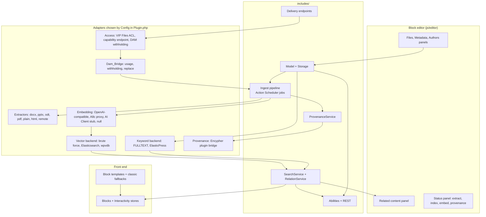
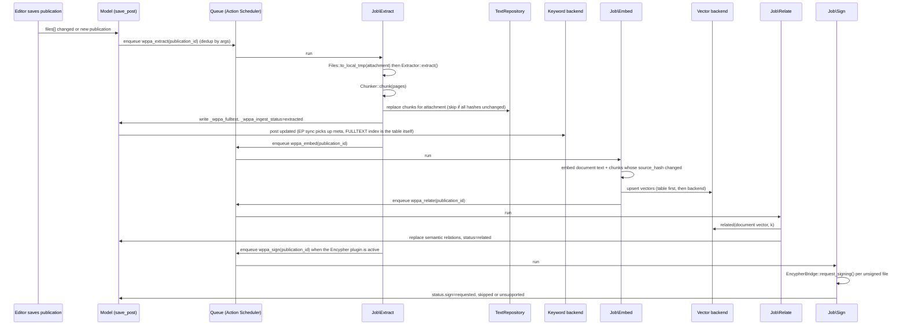
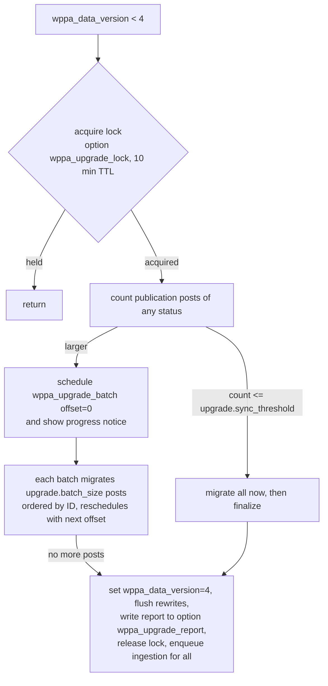

# WP Publication Archive 4.0.0 — Specification

Version: 2.0
Status: ready for planning (fly after 3.1.0 has merged; see "Flying this spec")
Date: 2026-09-24
Supersedes: v1.0 (2026-09-20), which assumed a from-scratch `src/` rewrite

## Flying this spec

This is the **second** Foundry flight for this repository. The first, `docs/SPEC.md` for 3.1.0, builds the foundation this spec extends. Fly this one only from a `master` that contains the merged 3.1.0 build.

It targets **Foundry 0.3.2**, whose implement stage is serial. Parallelism is planned by hand, as workstreams (§8.0). This is the same model the 3.1.0 flight used.

To prepare the flight, in a clean checkout of `master`:

```bash
mkdir -p .foundry-archive/3.1.0
git mv docs/PLAN.md docs/PROGRESS.md docs/HANDOFF.md docs/REVIEW.md docs/SUMMARY.md .foundry-archive/3.1.0/ 2>/dev/null || true
git mv docs/SPEC.md .foundry-archive/3.1.0/SPEC.md
git mv V4_SPEC.md docs/SPEC.md
cp V4_FOUNDRY.json docs/foundry.json && git rm -q V4_FOUNDRY.json
git add -A && git commit -m "spec: 4.0.0"
claude   # then /foundry:go-flight
```

Why each step matters:

- **The 3.1.0 flight files move out of `docs/`.** The planner opens every file in `docs/` as a fixture, and Foundry decides it has "no plan yet" only when `docs/PLAN.md` is absent.
- **The archive directory name starts with a dot**, so neither the planner nor phpcs walks into it.
- **`V4_FOUNDRY.json` becomes `docs/foundry.json` before planning.** A committed project override is the only routing layer that reaches the planner (§7.1).

`docs/HOOKS.md`, `docs/CONTRIBUTING.md` and `docs/adr/` stay: they are living documents this build keeps current.

Background, platform research and the reasoning behind every choice are in `V4-ASSESSMENT.md` at the repository root. The planner does not need it. This spec is self-contained, except that it names the 3.1.0 code on `master` as the starting point: "3.1.0" below means that code as merged.

## 1. Overview

WP Publication Archive 4.0.0 turns the plugin into a publication layer that sits on WordPress's media library and extends the VIP Digital Asset Manager ("the DAM"), without requiring it.

**What a publication is.** A *publication* is a document with a public identity:

- authors, and a publication date distinct from the post date;
- an abstract, a document type and a license;
- an optional DOI and ISBN;
- a canonical file plus alternates;
- a landing page and a citation;
- extracted full text and embeddings;
- relationships to other publications and to ordinary posts;
- a provenance status, supplied by the Encypher plugin when it is installed.

**Who owns what.** The plugin owns the publication's identity and the data derived from its files. The file bytes, and everything about them as assets, belong to the media library. That covers rights, embargo, lifecycle, folders, tags, versions, duplicates, usage and review. On a site running the DAM, the DAM governs those assets and this plugin defers to it. On a site without the DAM, core attachments serve and the asset features simply do not exist.

**Search.** Keyword search runs over extracted text, in MySQL FULLTEXT or ElasticPress. Semantic search and relationships run over vectors, in Elasticsearch, wpvdb or a brute-force fallback. Everything platform-specific is an adapter chosen by configuration.

**Audiences.** One plugin serves three:

- wordpress.org sites on any host;
- WordPress.com and WP Cloud sites (MariaDB 11.8, with native vectors through wpvdb);
- WordPress VIP (MySQL 8; Elasticsearch 8.18 through Enterprise Search or a customer-owned cluster; VIP File System; Files ACL; Integration Center delivery; and the DAM).

**Upgrade, not compatibility.** Sites on 3.0.1 or 3.1.0 are force-upgraded on first load: their publications, files and metadata migrate forward. That is the whole of 4.0's obligation to 3.x. 4.0 is a new product. It keeps none of 3.x's public surface: URLs, hooks, class names, shortcode, widgets, templates and plain-permalink handling all go. Nothing in 4.0's design is constrained by a 3.x decision. The readme upgrade notice lists what changes (§6.15).

**How it is built.** 4.0 is built on the 3.1.0 foundation, which is the `eamann-plugin-template` layout. It keeps:

- the composition root, and the rule that names, options, hook registration and hook firing each live in one place;
- the injected `Clock` and the test map;
- wp-env with the DAM, the CI split and the Foundry constraints.

It extends them with modules; it does not replace them. The 3.1.0 *engineering* is kept; the 3.1.0 *compatibility surface* is deleted (§4.1).

**Done means all of the following:**

- every phase in §8 is complete, and every command in §7 passes;
- 3.0.1 and 3.1.0 fixture sites upgrade with no data loss;
- the blocks render in a block theme, and the classic fallbacks in a classic theme;
- against mocked providers, the ingestion pipeline turns a fixture PDF and DOCX into chunks, full text, vectors and relations, and sends signing requests to the Encypher stub;
- with the DAM loaded, the DAM integration tests (§6.14) pass: publication files count as used, withheld files are not delivered, and replaced files follow;
- the plugin zip installs on a clean WordPress 7.1.

## 2. Goals and non-goals

**Goals**

- **G1. Files are attachments.** Publications are attachments plus metadata. No URL strings stand in for files. The thumbnail is the featured image. Everything is registered meta with a REST schema.
- **G2. A safe upgrade.** The upgrade from 3.0.1 and from 3.1.0 is forced, idempotent and resumable. It migrates every publication, file reference, thumbnail and description, and never deletes or unpublishes a publication. It does not preserve 3.x URLs or any other 3.x interface (§6.15).
- **G3. Blocks for the front end.** Every front-end surface is a block and a block template. There is no shortcode and there are no widgets. Classic themes get PHP fallbacks that render the same blocks.
- **G4. Full-text extraction.** PHP extracts DOCX, PPTX, ODT, PDF (the text layer), plain text and HTML. A provider interface allows hosted parsers. Chunking is deterministic. Full text is searchable through MySQL FULLTEXT on any host, and through ElasticPress/Enterprise Search where present.
- **G5. Embeddings and vector storage are separate concerns.**
  - Embeddings come through a provider interface: OpenAI-compatible endpoints including Voyage, the Automattic AI proxy, and a stub for the WordPress AI Client.
  - Vectors go through a store interface with three backends: Elasticsearch, wpvdb, and brute force over a MySQL table. The MySQL table is always the source of truth.
  - Any provider can feed any backend, and no backend ever generates embeddings.
  - The Elasticsearch backend is cluster-agnostic. The same mapping and kNN query run either in-index through ElasticPress filters on a shared Enterprise Search cluster, or over direct HTTP against a separate index on a customer-owned, Fueled/ElasticPress.io or self-hosted cluster.
- **G6. Relationships.** Publication to publication, and post to publication. They are computed from document-level vectors, stored in a table, editable (pin, dismiss), and shown in blocks and in an editor sidebar panel.
- **G7. Delivery.**
  - A file is delivered by redirecting to the file's own URL.
  - Restricted publications use VIP Files ACL where it is available, and a capability-checked endpoint elsewhere.
  - Files the DAM withholds are never delivered to people who cannot edit them.
  - File URLs are 4.0's own design (§6.7). Plain permalinks are not supported.
- **G8. Abilities.** Search, related, get, cite, verify and ingest are registered through the Abilities API, and marked MCP-public where that is safe. They follow the DAM's ability conventions (§6.12).
- **G9. Provenance through the Encypher plugin only.**
  - Detect the plugin.
  - Request signing of publication files on publish, through its own hooks.
  - Include the `publication` post type in the content it signs.
  - Show its per-asset status in a badge, a list column, the status panel and an Ability.
  - This plugin signs nothing itself.
- **G10. Scholarly metadata.** Landing pages carry Schema.org JSON-LD (`ScholarlyArticle` or `Report`, by document type) and Google Scholar `citation_*` meta tags. Citations are output in APA, Chicago and BibTeX.
- **G11. Configuration.** Precedence is: a PHP constant (for VIP Integration Center config injection), then an option, then the default. There is a settings page and a tools page in admin, and WP-CLI for every batch operation.
- **G12. Test coverage.**
  - Every PHP module is tested in wp-env.
  - Pure editor logic has JS unit tests.
  - The editor sidebar and the search block have Playwright e2e tests.
  - A `dam` test group runs with the DAM loaded.
- **G13. Extend the DAM.** When the DAM is active:
  - publication files are part of its usage index;
  - its withholding (embargo, lifecycle, trash) governs delivery;
  - its file replacements carry into publications;
  - its rights data pre-fills publication metadata in the editor;
  - its folders, tags and duplicate warnings appear in the file picker at no cost.

  When the DAM is absent, every one of these is inert, and nothing else changes (§6.14).
- **G14. Keep the 3.1.0 engineering, not its compatibility surface.** Keep every 3.1.0 principle (§3 P1–P9), constraint, tool and the DAM wiring. Delete everything 3.1.0 kept for 3.0.1's sake (§4.1, §6.15).

**Non-goals** (out of scope for every task)

- **Nothing the DAM does.** No folders, file versioning, rights management, duplicate detection, lightboxes, review workflow or multisite federation. On a DAM site the DAM does them. On any other site they do not exist. This plugin never re-implements an asset feature the DAM provides.
- **No hard dependency on the DAM**, and no DAM feature required for any goal except G13.
- **No calls into DAM internals except through `Dam_Bridge`.** Anything that goes beyond the DAM's public hooks and Abilities is confined to `Dam_Bridge` and pinned by a contract test (§6.14).
- **No PHP proxying or streaming of public files.** §6.7 allows exactly one streaming path, for restricted files on hosts without a sendfile header, in one file.
- **No custom vector index.** The brute-force backend reads the table; it does not build an ANN structure.
- **No sharing of vectors or embeddings with the DAM.** The DAM has no vector store today. Offering ours to it is a later release.
- **No embedding providers beyond the three named in G5.**
- **No text-generation features** except the optional abstract draft in §6.11, which uses only the WordPress AI Client.
- **No OCR.** Scanned PDFs yield zero chunks and a status of `no_text`.
- **No provenance work of our own.** No signing, no hashing for provenance, no manifest generation, no C2PA library use, and no calls to Encypher's hosted API. Provenance is the Encypher plugin's job. Ours is to ask it and to show what it reports. The DAM's own AI-provenance marking is also left alone.
- **No download analytics** beyond the optional counter in §6.7.
- **No support for WordPress below 7.0 or PHP below 8.2.**
- **No 3.x compatibility.** No class aliases, no 3.x filter or action names, no shortcode, no legacy widgets, no theme-template overrides, no 3.x URL shapes or query forms, no plain-permalink support, and no `WP_PUB_ARCH_*` constants. No reading of 3.x meta or options outside `includes/upgrade/` and tests. A 3.x behaviour is never a reason for a 4.0 design choice.
- **No new top-level admin menus.** Everything lives under the Publications post type menu.
- **No jQuery in new JavaScript.**

## 3. Engineering principles

Each rule can be checked by a tool or a grep. Every rule tagged `[constraint: <id>]` is an entry in `V4_FOUNDRY.json` (which becomes `docs/foundry.json`), where it self-tests against fixture lines, and `foundry_verify` runs it on every task. The reviewer treats a violation as the most severe finding.

### 3.1 Kept from 3.1.0 (the foundation)

These are unchanged in meaning. Only paths widen to the new module directories.

- **P1. One place for every name.** Every one of these is a `Keys` constant:
  - option, meta, term-meta, transient and cache names;
  - hook, cron and Action Scheduler hook names;
  - table suffixes, the REST namespace, block and ability names;
  - script and style handles, the CLI command and config keys.

  A string literal beginning with `wppa_`, `_wppa_`, `wppa-`, `wppa/`, `wpa_`, `wpa-`, `wp_pubarch` or `wp-publication-archive` appears nowhere else under `includes/`, `blocks/*/render.php`, `templates/`, the bootstrap, `uninstall.php` or `tests/`. There are two exemptions: the text domain as the last argument of an i18n call, and HTML attribute values. `block.json` files are exempt; `tests/unit/test-block-json.php` asserts that each one agrees with `Keys`. `[constraint: names-in-keys-only]`
- **P2. Options are read and written only in `Flags`.** `Support\Config` reads options through `Flags::settings()`, and nothing else calls option functions. `[constraint: options-read-in-flags-only]`
- **P3. Hooks register only in `Plugin`.** That covers `add_action`, `add_filter`, their `remove_` counterparts and `add_shortcode`, including the ElasticPress, VIP and DAM hooks. `[constraint: hooks-register-in-plugin-only]`
- **P4. Hooks fire only through `Hooks`.** `do_action` and `apply_filters` go through one static method per hook. `[constraint: hooks-fire-in-hooks-only]`
- **P5. Stubs fail loudly.** `throw new NotImplementedException( __METHOD__ );`, never TODO or FIXME. `[constraint: no-stub-markers]`
- **P6. Lint is clean with reasons.** Every `phpcs:ignore` carries `-- reason:`, and none silences `WordPress.Security`. `[constraint: phpcs-ignore-needs-reason]` `[constraint: no-security-ignores]`
- **P7. No wall clock.** Time and date-formatting functions appear only in `includes/class-clock.php`. That covers `time`, `current_time`, `date`, `gmdate`, `microtime`, `strtotime`, `wp_date` and `date_i18n`. It also makes the pure files deterministic: the Chunker, Math, Citation and `Url_Policy`. `created_at` columns and signed-URL expiries take `Clock::now()`. `[constraint: no-wall-clock]`
- **P8. Namespaced, no globals.** No functions at file scope. No `global $` except `$wpdb` and `$wp_version`. `[constraint: no-file-scope-functions]` `[constraint: no-globals]`
- **P9. Every class has a test with the same slug, written in the same task.**
  - `composer test:map` checks that every `includes/**/class-*.php` and `interface-*.php` has `tests/unit/test-<slug>.php` or `tests/integration/test-<slug>.php`.
  - It also checks a `WPPA` or `WPPA\…` namespace, a `SPEC.md §` reference, an `@author` tag, and `declare( strict_types=1 );` (P16).
  - Slugs are unique across `includes/`. `test-map` fails on a duplicate. That is why interfaces are named for their role (`VectorBackend`, `EmbeddingProvider`) and not `Contract`.

- **Also carried from 3.1.0.** These keep 3.1.0's meaning:
  - WP-CLI only in `Cli`, `Plugin` and `includes/cli/`. `[constraint: wp-cli-confined]`
  - The pure leaves in §4.2 import nothing. `[constraint: leaf-files-import-nothing]`
  - No `extract()`. `[constraint: no-extract]`
  - No superglobals under `includes/`; request data comes through `WP_REST_Request` or `get_query_var()`. `[constraint: superglobals-confined]`
  - No reference to the removed 3.0.1 paths. `[constraint: no-legacy-asset-paths]`

### 3.2 Added for 4.0

- **P10. SQL lives in one place.** `$wpdb` appears only under `includes/storage/`. `[constraint: sql-in-storage-only]`
- **P11. Network access lives in one place.** Only `wp_safe_remote_*` is allowed, and only in `includes/support/class-http.php`. `wp_remote_*` and `sslverify` appear nowhere. Every provider adapter receives a `Support\Http`. `[constraint: network-in-http-only]` `[constraint: safe-remote-only]`
- **P12. File bytes are read in one place.**
  - `file_get_contents(`, `fopen(`, `fread(`, `file(` and `copy(` appear only in `includes/support/class-files.php`, which handles the VIP stream wrapper, temp files and size limits.
  - `readfile(` and `fpassthru(` appear only in `includes/delivery/class-streamer.php`.

  `[constraint: file-bytes-in-files-only]` `[constraint: byte-output-in-streamer-only]`
- **P13. Platform detection lives in one place.** These symbols appear only under `includes/platform/` and in the adapter that wraps each one:
  - `VIP_GO_ENV`, `VIP_GO_APP_ENVIRONMENT`, `WPCOM_IS_VIP_ENV`, `IS_ATOMIC`, `IS_WPCOM` and `Automattic\VIP\` (platform);
  - `ElasticPress\` (the ES backend and the EP keyword backend);
  - `WPVDB\` (the wpvdb backend);
  - `Encypher` (the Encypher bridge);
  - `VIP\DAM\` and `VIP_DAM_` (`includes/dam/class-dam-bridge.php`, and nowhere else).

  `[constraint: platform-symbols-confined]` `[constraint: dam-symbols-confined]`
- **P14. Adapters are built only in `Plugin`.** Every class under `includes/*/backend/`, `includes/*/embedding/`, `includes/*/keyword/` and `includes/ingest/extractor/`, plus the Encypher and DAM bridges, is instantiated only in `includes/class-plugin.php`. `[constraint: adapters-built-in-plugin]`
- **P15. Every tunable is a config key.** Every value marked ⚠️ ASSUMPTION in §5.4 is read through `Support\Config::get()`, and its default is a `Keys` constant. The reviewer greps each literal from §5.4 across `includes/`, `blocks/` and `js/`, excluding `class-keys.php`.
- **P16. Strict types.** `declare( strict_types=1 );` is the first statement of every PHP file under `includes/` and `blocks/`. `test-map` checks this (P9).
- **P17. v3 meta keys are quarantined.** The `Keys::V3_*` constants appear only under `includes/upgrade/` and `tests/`. Those constants are `wpa_upload_doc`, `wpa-upload_image`, `wpa-upload_alternates` and `wpa_doc_desc`. `[constraint: v3-meta-quarantined]`
- **P18. Blocks are declared, not improvised.**
  - Every block has `blocks/<name>/block.json` with `"render": "file:./render.php"`, `apiVersion` 3 and `"textdomain": "wp-publication-archive"`.
  - Render callbacks escape every value.
  - There is no `dangerouslySetInnerHTML` in `js/` or `blocks/`. `[constraint: no-dangerous-html]`
- **P19. No jQuery.** `jQuery` and `$(` appear nowhere in `js/` or `blocks/`. `[constraint: no-jquery]`
- **P20. Idempotent batch jobs.** Every job under `includes/ingest/job/` and `includes/upgrade/` checks a hash or a status before doing work. Each is tested by running it twice against the same fixture.
- **P21. No debug output.** `WordPress.PHP.DevelopmentFunctions` runs at error severity. Logging goes through `Support\Logger`, which does nothing unless `WP_DEBUG` or `WPPA_DEBUG` is set.
- **P22. PHP 8.2 and versions in `Keys`.** `PHPCompatibilityWP` uses `testVersion 8.2-`, and PHPStan runs at level 6 with no baseline. `MIN_PHP` (`'8.2'`), `MIN_WP` (`'7.0'`) and `VERSION` are declared once. `[constraint: no-hardcoded-versions]`
- **P23. i18n.** The text domain literal is `wp-publication-archive` everywhere, and `WordPress.WP.I18n` is configured with it.

## 4. Architecture

### 4.1 Layout

The template shape from 3.1.0 is kept: a classmap over `includes/`, `class-<slug>.php` files, and the `WPPA` root namespace with one sub-namespace per module directory. The module directories are new.

```
wp-publication-archive.php       Headers, ABSPATH guard, vendor/autoload.php, PHP/WP guards against Keys,
                                 Plugin::boot(), activation and deactivation (the 3.x WP_PUB_ARCH_* constants are removed)
uninstall.php                    Removes options, tables (only if WPPA_UNINSTALL_DROP_TABLES) and _wppa_ meta
humans.txt                       Template attribution (kept)
includes/
  class-plugin.php  class-keys.php  class-flags.php  class-hooks.php  class-clock.php
  class-not-implemented-exception.php  class-cli.php  class-assets.php  class-rest.php
                                 The 3.1.0 foundation, extended in place. Plugin builds every adapter from Config
  support/    Config Http Files Logger Json Nonce
  platform/   Platform                      vip|wpcom|generic; has_elasticpress, has_wpvdb, has_files_acl, has_encypher
  storage/    Schema TextRepository VectorRepository RelationRepository FulltextQuery FileReferenceQuery
  model/      PostType Taxonomies Meta Capabilities Publication File Author
  upgrade/    Url_Policy (the 3.1.0 leaf, moved; gains classify()) Upgrader UpgradeBatchJob UpgradeNotices SchemaVersion
  ingest/     Queue Pipeline Chunker Chunk IngestStatus Extractor (interface) ExtractionResult
              extractor/  DocxExtractor PptxExtractor OdtExtractor PdfTextExtractor PlainExtractor HtmlExtractor RemoteExtractor
              job/        ExtractJob EmbedJob RelateJob SignJob
  search/     Math SearchService RelationService QueryEmbeddingCache SearchRequest SearchResult Filters Hit VectorRecord
              embedding/  EmbeddingProvider (interface) OpenAiCompatibleProvider AutomatticProxyProvider WpAiClientProvider NullProvider
              backend/    VectorBackend (interface) BruteForceBackend ElasticsearchBackend WpvdbBackend
              keyword/    KeywordBackend (interface) FulltextBackend ElasticPressBackend
  provenance/ EncypherBridge ProvenanceStatus ProvenanceService Badge
  dam/        Dam_Bridge                    The 3.1.0 bridge, moved and extended (§6.14)
  delivery/   Endpoints (was 3.1.0 Delivery) Rewrites Access VipFilesAcl SignedUrl Streamer DownloadCounter
  citation/   Formatter JsonLd ScholarTags
  rest/       SearchController RelatedController RelationsController FilesController IngestController StatusController
              VerifyController DownloadsController SettingsController ToolsController DraftAbstractController
  abilities/  AbilityRegistrar, and one <Name>Ability class per ability in §6.12
  blocks/     BlockRegistrar Icons (was 3.1.0 Icons)
  templates/  BlockTemplates ClassicTemplates (was 3.1.0 Templates)
  admin/      EditorAssets ListTable SettingsPage ToolsPage Notices
  cli/        PublicationsCommand
blocks/<name>/                   block.json, index.js, edit.js, render.php, style.scss (source)
js/editor/                       Editor sidebar plugin (Files, Metadata, Authors, Related, Status panels)
js/interactivity/                Interactivity API stores for the search and list blocks
build/                           wp-scripts output (gitignored; built in CI and by composer build)
templates/                       single-publication.html, archive-publication.html (block templates);
                                 classic/single-publication.php, classic/archive-publication.php (new; call do_blocks(); §6.8)
assets/                          css/base.css, icons/*.png (from 3.1.0); js/admin-media.js deleted (the sidebar replaces meta boxes)
languages/                       from 3.1.0; the POT is regenerated in Phase 6
tests/unit/ tests/integration/ tests/integration/dam/ tests/e2e/ tests/fixtures/ tests/stubs/
bin/                             3.1.0 scripts plus the npm build step in build-zip.sh
docs/                            SPEC.md foundry.json HOOKS.md CONTRIBUTING.md adr/ reference/acme-semantic/
readme.txt, CHANGELOG.md, vip-manifest.yaml (§6.13)
```

**File naming.** The class names above are normative, and each lives in its module directory under the namespace `WPPA\<Module>` (for example `WPPA\Search\Backend\BruteForceBackend`). A class's file is `class-<slug>.php`, or `interface-<slug>.php` for an interface. The slug is the class name in lowercase, with each `_` and each lower-to-upper case boundary turned into `-`: `BruteForceBackend` → `class-brute-force-backend.php`, `Url_Policy` → `class-url-policy.php`, `VectorBackend` → `interface-vector-backend.php`. Slugs are unique across `includes/` (P9). The 3.1.0 classes keep their names (`Url_Policy`, `Dam_Bridge`, `Publication_Item`, the widgets), because the aliases and tests name them.

The Phase 0 module move deletes, outright, every 3.1.0 file that exists for 3.0.1 compatibility, together with its tests:

| 3.1.0 code | Fate |
|---|---|
| `includes/legacy/` (the six `class_alias`es and the static and singleton delegates), `tests/integration/test-aliases.php` | Deleted |
| `includes/widgets/` (three `WP_Widget`s) | Deleted. Blocks replace them |
| `class-shortcode.php`, `templates/classic/template.wppa_*.php` | Deleted. The `publication-list` and `publication-dropdown` blocks replace them |
| `class-templates.php` theme-override lookup (`locate_template()` of 3.x names) | Deleted. `Templates\ClassicTemplates` is new and knows no 3.x names |
| `class-publication-item.php`, `class-categories.php` | Deleted. `Model\Publication` and the blocks replace them |
| `class-meta-boxes.php`, `assets/js/admin-media.js` | Deleted. The editor sidebar replaces them (§6.13) |
| `class-upgrade.php` | Replaced by `Upgrade\Upgrader` |
| `class-rewrites.php` (3.x URL shapes, reserved-slug rule, query forms) | Replaced by `Delivery\Rewrites` with 4.0's own endpoint (§6.7) |
| Every 3.x filter and action in `Hooks`/`Keys` (`wpa-*`, `wppa_mask_url`, `wp_pubarch_*` and so on) | Deleted. 4.0 hooks are designed fresh and documented in `docs/HOOKS.md` |
| The `WP_PUB_ARCH_*` bootstrap constants | Deleted |

Kept and moved into modules: `Plugin`, `Keys`, `Flags`, `Hooks` (emptied of 3.x names), `Clock`, `Cli` (`doctor`), `Assets`, `Rest` (`/eam`), `Url_Policy`, `Delivery` (as `Endpoints`), `Streamer`, `Post_Type`, `Capabilities`, `Dam_Bridge`, `Icons`, the test harness, `bin/`, CI and the DAM wiring.

### 4.2 Module dependency rules

Arrows point one way. The reviewer checks `use WPPA\…` imports against this table.

| Module | May import from |
|---|---|
| `Keys`, `Clock`, `NotImplementedException`, `Upgrade\Url_Policy`, `Ingest\Chunker`, `Search\Math`, `Citation\Formatter` | nothing (pure leaves) |
| `Flags`, `Hooks`, `Support\`, `Platform\` | `Keys`, `Clock`, each other |
| `Storage\` | the above |
| `Model\` | the above, `Storage\` |
| `Dam\` | the above, `Model\`, `Upgrade\Url_Policy` |
| `Upgrade\` | the above, `Model\`, `Ingest\Queue` (to enqueue) |
| `Ingest\` | the above, `Model\`, `Search\Embedding`, `Search\Backend`, `Provenance\ProvenanceService` (Job\Sign only) |
| `Search\` | the above, `Model\`, `Platform\` |
| `Provenance\` | the above, `Model\`, `Platform\` |
| `Delivery\` | the above, `Model\`, `Platform\`, `Dam\` |
| `Citation\` | `Model\Publication` (the value object) only |
| `Rest\`, `Abilities\`, `Blocks\`, `Templates\`, `Admin\`, `Cli` | anything above |
| `Plugin` | everything |

### 4.3 Component diagram



### 4.4 Ingestion sequence



## 5. Data and configuration

### 5.1 Post type, taxonomies, capabilities

- `register_post_type( 'publication', ... )`: `public`, `show_in_rest`, `rest_base => 'publications'`, `has_archive => true`, `rewrite => [ 'slug' => 'publication', 'with_front' => false ]`, `supports => [ 'title', 'editor', 'excerpt', 'thumbnail', 'revisions', 'custom-fields', 'author' ]`, `capability_type => [ 'publication', 'publications' ]`, `map_meta_cap => true`, `menu_icon => 'dashicons-media-document'`, `template` (block template for new posts: a Paragraph placeholder for the abstract), `taxonomies => [ 'category', 'post_tag', 'publication-author', 'publication-type' ]`.
- `publication-author`: non-hierarchical, public, `show_in_rest`, `rewrite => [ 'slug' => 'publication/author' ]`, term meta `orcid` (string, validated against `^\d{4}-\d{4}-\d{4}-\d{3}[\dX]$`), `affiliation` (string), `user_id` (integer, optional link to a WP user); all three registered with `register_term_meta` and `show_in_rest`.
- `publication-type`: hierarchical, public, `show_in_rest`, `rewrite => [ 'slug' => 'publication/type' ]`. Seeded on install with `report`, `brief`, `white-paper`, `dataset`, `transcript`, `article`, `presentation` (names translatable; slugs fixed).
- Capabilities: on install and on upgrade, `administrator` and `editor` receive every `publication` capability; `author` receives `edit_publications`, `edit_published_publications`, `publish_publications`, `delete_publications`, `delete_published_publications`, `upload_files`; `contributor` receives `edit_publications`, `delete_publications`. A separate capability `read_restricted_publications` is granted to `administrator`, `editor`, `author`, `contributor` and `subscriber` on install; site owners remove it from roles they want restricted. Grants are idempotent, recorded in option `wppa_caps_version` (integer).

### 5.2 Registered post meta (all `show_in_rest` with schema, `single => true` unless noted, `auth_callback` requires `edit_post`)

| Key | Type / schema | Sanitize | Notes |
|---|---|---|---|
| `_wppa_files` | array of objects `{ attachment_id: integer, role: enum[canonical, alternate, dataset, accessible], label: string, language: string (BCP 47, may be empty), external_url: string(uri, may be empty), checksum: string (sha256 hex or empty) }` | each row validated; exactly one row with `role=canonical` unless the array is empty | `external_url` is set only by the upgrader for unresolvable remote files; it is never proxied; rows with `attachment_id=0` must have `external_url` |
| `_wppa_publication_date` | string, format `date` (`YYYY-MM-DD`) | must parse | defaults to post date on first save if empty |
| `_wppa_document_type` | string | must be a `publication-type` slug or empty | mirrors the primary `publication-type` term; kept as meta so Block Bindings can read it |
| `_wppa_publisher` | string | `sanitize_text_field` | |
| `_wppa_doi` | string | matches `^10\.\d{4,9}/\S+$` or empty | |
| `_wppa_isbn` | string | digits and X, 10 or 13 chars after stripping hyphens, or empty | |
| `_wppa_license` | string | `sanitize_text_field` | free text, e.g. `CC BY 4.0` |
| `_wppa_language` | string | BCP 47 or empty | |
| `_wppa_page_count` | integer | >= 0 | set by extraction |
| `_wppa_citation_override` | string | `wp_kses_post` | when set, replaces generated citations |
| `_wppa_access` | enum `public|restricted` | | default `public` |
| `_wppa_fulltext` | string, `show_in_rest => false` | none (written by the pipeline only; `auth_callback` denies REST writes) | concatenated chunk text, capped (section 5.4) |
| `_wppa_ingest_status` | object `{ extract: enum[pending, running, extracted, no_text, failed], embed: enum[pending, running, done, skipped, failed], relate: same, sign: enum[pending, running, requested, skipped, unsupported, failed], updated_at: string(date-time), message: string }` | pipeline only | `sign` records only whether a signing request was handed to the Encypher plugin; the signing state itself is read from that plugin |
| `_wppa_downloads` | integer | pipeline only | optional counter, section 6.7 |
| `_wppa_needs_review` | string | upgrader only | non-empty means the upgrader could not resolve a file; the value is the reason |

The thumbnail is `_thumbnail_id` (core). Ordinary posts (section 6.5) may carry `_wppa_relations_dismissed` (array of publication IDs) so dismissed suggestions do not return.

### 5.3 Tables (created by `WPPA\Storage\Schema::install()` with `dbDelta()`, version in option `wppa_schema_version`)

```
{prefix}wppa_text
  id             BIGINT UNSIGNED NOT NULL AUTO_INCREMENT
  post_id        BIGINT UNSIGNED NOT NULL          -- the publication
  attachment_id  BIGINT UNSIGNED NOT NULL
  chunk_index    INT UNSIGNED NOT NULL             -- 0-based within the attachment
  page_start     SMALLINT UNSIGNED NULL
  page_end       SMALLINT UNSIGNED NULL
  text           LONGTEXT NOT NULL
  text_hash      CHAR(64) NOT NULL                 -- sha256 of normalized text
  token_estimate INT UNSIGNED NOT NULL
  extractor      VARCHAR(32) NOT NULL
  created_at     DATETIME NOT NULL
  PRIMARY KEY (id)
  UNIQUE KEY attachment_chunk (attachment_id, chunk_index)
  KEY post_id (post_id)
  FULLTEXT KEY text (text)

{prefix}wppa_vectors
  id             BIGINT UNSIGNED NOT NULL AUTO_INCREMENT
  post_id        BIGINT UNSIGNED NOT NULL          -- publication or ordinary post
  level          TINYINT UNSIGNED NOT NULL         -- 0 = document, 1 = chunk
  text_id        BIGINT UNSIGNED NULL              -- wppa_text.id for level 1, NULL for level 0
  model          VARCHAR(64) NOT NULL
  dims           SMALLINT UNSIGNED NOT NULL
  vector         LONGBLOB NOT NULL                 -- pack('g*', ...floats) little-endian float32
  source_hash    CHAR(64) NOT NULL                 -- sha256 of the text embedded
  created_at     DATETIME NOT NULL
  PRIMARY KEY (id)
  UNIQUE KEY post_level_text_model (post_id, level, text_id, model)
  KEY model_level (model, level)

{prefix}wppa_relations
  id             BIGINT UNSIGNED NOT NULL AUTO_INCREMENT
  from_post_id   BIGINT UNSIGNED NOT NULL
  to_post_id     BIGINT UNSIGNED NOT NULL
  type           VARCHAR(24) NOT NULL              -- related | cites | supersedes | translation_of | derived_from
  source         VARCHAR(12) NOT NULL              -- manual | semantic | import
  score          DECIMAL(6,5) NULL                 -- cosine similarity for semantic rows
  pinned         TINYINT(1) NOT NULL DEFAULT 0     -- manual rows are pinned; semantic rows may be pinned by an editor
  created_at     DATETIME NOT NULL
  PRIMARY KEY (id)
  UNIQUE KEY from_to_type (from_post_id, to_post_id, type)
  KEY to_post (to_post_id)
```

`dbDelta()` on InnoDB supports `FULLTEXT`; the schema installer verifies the index exists after creation and records `wppa_fulltext_available` (bool option) so the keyword backend can fall back to `LIKE` on hosts where it is missing. Row deletion: deleting a publication (`before_delete_post`) removes its rows from all three tables and its vectors from the active backend; deleting an attachment removes its `wppa_text` rows and chunk vectors and re-enqueues extraction for the publication.

### 5.4 Configuration

`WPPA\Support\Config::get( string $key )` resolves, in order (the option layer is read through `Flags::settings()`, P2; defaults are `Keys` constants, P15): a PHP constant `WPPA_CONFIG` (array, or JSON string) containing the key; a PHP constant `VIP_WP_PUBLICATION_ARCHIVE_CONFIG` (JSON string; the shape VIP's Integration Center injects ⚠️ ASSUMPTION, key `platform.vip_config_constant`); the option `wppa_settings` (array); the defaults below. Keys are dotted. Secrets (`*.api_key`, `*.token`) are never returned to REST or JS; the settings page shows only whether they are set.

| Key | Default | ⚠️ | Meaning |
|---|---|---|---|
| `ingest.enabled` | `true` | | Master switch for extraction |
| `ingest.max_file_bytes` | `104857600` (100 MiB) | ⚠️ | Files larger than this are not extracted; status `failed` with message |
| `ingest.tmp_dir` | `sys_get_temp_dir()` | | Where `Files::to_local_tmp()` writes |
| `ingest.chunk_target_tokens` | `400` | ⚠️ | Chunker target |
| `ingest.chunk_overlap_tokens` | `40` | ⚠️ | Overlap between consecutive chunks |
| `ingest.chunk_max_tokens` | `800` | ⚠️ | Hard split above this |
| `ingest.fulltext_max_bytes` | `500000` | ⚠️ | Cap on `_wppa_fulltext` |
| `ingest.pdf.memory_limit` | `512M` | ⚠️ | `ini_set` applied around `PdfText` parsing when the current limit is lower |
| `ingest.remote.endpoint` | `''` | | URL of a hosted parser proxy (section 6.3); empty disables |
| `ingest.remote.api_key` | `''` | | Bearer token for it |
| `ingest.remote.mime_types` | `[ 'application/pdf' ]` | | Which types go to the remote extractor instead of the PHP one |
| `ingest.batch_size` | `20` | ⚠️ | Publications per bulk (CLI / tools page) batch |
| `embedding.provider` | `'null'` | | `null`, `openai`, `automattic`, `wp_ai_client` |
| `embedding.openai.base_url` | `'https://api.openai.com/v1'` | | Any OpenAI-compatible base (Voyage: `https://api.voyageai.com/v1`) |
| `embedding.openai.api_key` | `''` | | |
| `embedding.openai.model` | `'text-embedding-3-small'` | | |
| `embedding.openai.dims` | `1536` | | Declared dimensions; used to validate responses |
| `embedding.openai.max_batch` | `64` | ⚠️ | Inputs per request (Voyage accepts 128) |
| `embedding.openai.input_type_param` | `false` | | When true, send `input_type: document` for indexing and `input_type: query` for queries (Voyage's asymmetric models); ignored by OpenAI |
| `embedding.openai.max_chars` | `32000` | ⚠️ | Input text is truncated to this many characters before embedding |
| `embedding.retry_attempts` | `5` | ⚠️ | Attempts on 429 and 5xx |
| `embedding.retry_base_delay` | `1` | ⚠️ | Seconds; doubles per attempt; a `Retry-After` header overrides |
| `embedding.automattic.base_url` | `'https://public-api.wordpress.com/wpcom/v2/ai-api-proxy/v1'` | | |
| `embedding.automattic.path` | `'/embeddings/text'` | ⚠️ | Endpoint path |
| `embedding.automattic.model` | `'nomic-embed-text-v2-moe'` | | |
| `embedding.automattic.dims` | `768` | | |
| `embedding.automattic.token` | `''` | | Bearer project token |
| `embedding.automattic.feature` | `'wp-publication-archive'` | | Sent as `X-WPCOM-AI-Feature` |
| `embedding.document_max_tokens` | `2000` | ⚠️ | Document-level vector is built from title + abstract + first chunks up to this budget |
| `vector.backend` | `'auto'` | | `auto`, `bruteforce`, `elasticsearch`, `wpvdb`. `auto` picks `elasticsearch` when ElasticPress is active and the post indexable is set up, else `wpvdb` when wpvdb reports native support, else `bruteforce` |
| `vector.bruteforce.max_chunk_vectors` | `50000` | ⚠️ | Above this count, brute-force chunk search is disabled (document-level only) |
| `vector.es.mode` | `'auto'` | | `auto`, `ep_index`, `separate_index`. `auto` picks `ep_index` when ElasticPress is active with the post indexable and `vector.es.host` is empty, `separate_index` when `vector.es.host` is set, else the backend is unavailable |
| `vector.es.host` | `''` | | Base URL of a cluster for `separate_index` (customer-owned, Fueled/ElasticPress.io, self-hosted). Empty on shared VIP Enterprise Search |
| `vector.es.auth` | `'none'` | | `none`, `basic` (user:pass in the URL), `api_key` (`vector.es.api_key` sent as `Authorization: ApiKey`) |
| `vector.es.api_key` | `''` | | |
| `vector.es.index` | `'wppa-vectors'` | | Index name for `separate_index`; prefixed with `vector.es.index_prefix` (default the site's `DB_NAME` hash, 8 chars) so several sites can share a cluster |
| `vector.es.num_candidates` | `100` | ⚠️ | kNN `num_candidates` floor; the effective value is `max( this, k * 5 )` |
| `vector.es.chunk_field` | `'wppa_chunks'` | | Nested field name (`ep_index`) |
| `vector.es.doc_field` | `'wppa_doc_vector'` | | Document vector field name (`ep_index`) |
| `vector.es.similarity` | `'cosine'` | | |
| `vector.es.timeout` | `15` | ⚠️ | Seconds per search request; `60` for bulk (`vector.es.bulk_timeout`) |
| `vector.es.bulk_size` | `100` | ⚠️ | Documents per `_bulk` request |
| `search.default_mode` | `'hybrid'` | | `keyword`, `semantic`, `hybrid`; hybrid degrades to keyword when the embedding provider is `null` |
| `search.hybrid.knn_boost` | `1.0` | ⚠️ | |
| `search.hybrid.bm25_boost` | `1.0` | ⚠️ | |
| `search.hybrid.rrf_k` | `60` | ⚠️ | RRF constant for fusion in `SearchService` (brute force, wpvdb, and ES `separate_index`); ES `ep_index` uses boosts inside one request |
| `search.hybrid.demote_threshold` | `0.5` | ⚠️ | Keyword-only hits whose cosine to the query vector is below this are demoted |
| `search.hybrid.demote_floor` | `0.3` | ⚠️ | Demotion multiplier at cosine 0, rising linearly to 1.0 at the threshold |
| `search.override_main_query` | `true` | | Apply `SearchService` to the main query on the publication archive when `?s=` is set, through `posts_pre_query` |
| `search.results_per_page` | `10` | | |
| `search.max_results` | `100` | ⚠️ | |
| `search.query_embedding_ttl` | `600` | ⚠️ | Seconds; transient cache of query vectors |
| `search.min_query_length` | `2` | | |
| `relations.k` | `10` | ⚠️ | Related items computed per publication |
| `relations.min_score` | `0.60` | ⚠️ | Cosine threshold for semantic rows |
| `relations.source_post_types` | `[ 'post' ]` | | Ordinary post types that get document vectors and post→publication relations |
| `relations.post_text_max_tokens` | `1000` | ⚠️ | Budget for an ordinary post's document vector (title + excerpt + content) |
| `relations.suggest_cache_ttl` | `900` | ⚠️ | Seconds; transient cache of editor suggestions keyed by post, text hash and limit |
| `editor.suggest_idle_ms` | `4000` | ⚠️ | Sidebar refreshes suggestions this long after typing stops |
| `editor.suggest_throttle_ms` | `60000` | ⚠️ | At most one content-driven refresh per this interval while typing continues |
| `editor.suggest_search_debounce_ms` | `800` | ⚠️ | Debounce for the sidebar's manual search box |
| `delivery.count_downloads` | `false` | | Enables the beacon and `_wppa_downloads` |
| `delivery.sendfile_header` | `''` | | `X-Sendfile` or `X-Accel-Redirect`; empty means stream in `Streamer` |
| `delivery.signed_url_ttl` | `300` | ⚠️ | Seconds |
| `delivery.restricted_capability` | `'read_restricted_publications'` | | |
| `provenance.request_on_publish` | `true` | | Ask the Encypher plugin to sign publication files when a publication is published or its files change |
| `provenance.include_landing_page` | `true` | | Add `publication` to the post types the Encypher plugin signs, through its filter |
| `provenance.encypher.detect` | `'class_exists:Encypher\\Plugin'` | ⚠️ | How the bridge detects the plugin; format `class_exists:<FQCN>`, `function_exists:<fn>` or `defined:<CONST>` |
| `provenance.encypher.status_meta` | `'_encypher_status'` | ⚠️ | Attachment/post meta key holding the plugin's signing state |
| `provenance.encypher.manifest_meta` | `'_encypher_manifest_id'` | ⚠️ | |
| `provenance.encypher.signed_at_meta` | `'_encypher_signed_at'` | ⚠️ | |
| `provenance.encypher.error_meta` | `'_encypher_error'` | ⚠️ | |
| `provenance.encypher.sign_action` | `'encypher_sign_attachment'` | ⚠️ | Action the bridge fires with an attachment ID to request signing; unused when `has_action()` is false |
| `provenance.encypher.post_types_filter` | `'encypher_post_types'` | ⚠️ | Filter the bridge hooks to append `publication` |
| `provenance.encypher.verify_url` | `'https://verify.encypher.com/'` | ⚠️ | Fallback verification link |
| `provenance.encypher.state_map` | `{ signed: [signed, complete, verified], queued: [queued, pending, processing], failed: [failed, error] }` | ⚠️ | Maps the plugin's raw status strings onto `ProvenanceStatus::state` |
| `upgrade.sync_threshold` | `200` | ⚠️ | Publications at or below this migrate synchronously on first load |
| `upgrade.batch_size` | `50` | ⚠️ | Per Action Scheduler batch above the threshold |
| `upgrade.sideload_remote` | `true` | | Download remote 3.x file URLs into the media library |
| `upgrade.sideload_max_bytes` | `104857600` | ⚠️ | |
| `ai.draft_abstract` | `false` | | Section 6.11 |
| `platform.vip_config_constant` | `'VIP_WP_PUBLICATION_ARCHIVE_CONFIG'` | ⚠️ | |
| `blocks.list_per_page` | `10` | | |

Filter `wppa_config` receives the merged array once per request so code can override without the settings page.

## 6. Interfaces

### 6.1 Publication value object

`WPPA\Model\Publication` (readonly properties, constructed from a `WP_Post` by `Publication::from_post()`): `id`, `title`, `slug`, `abstract` (post content), `excerpt`, `publication_date` (`DateTimeImmutable`), `document_type` (slug), `publisher`, `doi`, `isbn`, `license`, `language`, `page_count`, `access`, `files` (array of `WPPA\Model\File` with `attachment_id`, `role`, `label`, `language`, `external_url`, `checksum`, plus derived `url()`, `mime()`, `size_bytes()`, `filename()`), `canonical_file()` (`File|null`), `authors` (array of `Author`: `term_id`, `name`, `orcid`, `affiliation`, `user_id`), `thumbnail_id`, `categories`, `tags`, `status` (ingest status object), `provenance` (array). Nothing in this object performs queries after construction.

### 6.2 Ingest contracts

```php
namespace WPPA\Ingest;
interface Extractor {
    public function id(): string;                      // 'docx', 'pptx', 'odt', 'pdf_text', 'plain', 'html', 'remote'
    public function supports( string $mime, string $extension ): bool;
    /** @return ExtractionResult */
    public function extract( string $local_path, string $mime ): ExtractionResult;
}
final class ExtractionResult { /** @var array<int, array{number:int, text:string}> */ public array $pages; /** @var string[] */ public array $warnings; public ?int $page_count; }
```

Extractor selection: `Pipeline` asks extractors in the order `remote` (only when configured and the MIME type is in `ingest.remote.mime_types`), `pdf_text`, `docx`, `pptx`, `odt`, `html`, `plain`; the first whose `supports()` returns true handles the file. MIME comes from `get_post_mime_type()`, falling back to `wp_check_filetype()`.

- `Docx`: `ZipArchive` open, read `word/document.xml`; each `w:p` becomes a paragraph; `w:br w:type="page"` and `w:lastRenderedPageBreak` start a new page; text from `w:t` nodes joined; `w:tab` becomes a tab. Requires `ext-zip` and `ext-xml`; `supports()` returns false if either is missing.
- `Pptx`: `ppt/slides/slide{N}.xml` sorted by N; each slide is a page; `a:t` text nodes joined with spaces, paragraphs (`a:p`) with newlines.
- `Odt`: `content.xml`; `text:p` and `text:h` paragraphs; `text:soft-page-break` starts a page.
- `PdfText`: `smalot/pdfparser` (`^2.11`); `getPages()` each page `getText()`; a page whose text after normalization is under 20 characters counts as empty; if every page is empty the result has zero pages and the warning `no_text_layer`; encrypted PDFs throw, caught into warning `encrypted`; runs with `ini_set( 'memory_limit', Config ingest.pdf.memory_limit )` when the current limit is lower and restores it after.
- `Html`: `wp_strip_all_tags()` after removing `script`, `style`, `nav`, `header`, `footer` elements; single page.
- `Plain`: `text/plain`, `text/markdown`, `text/csv` (first 500 lines); single page.
- `Remote`: `POST {endpoint}` with multipart file field `file` and header `Authorization: Bearer {key}`; expects `200` with JSON `{ "pages": [ { "number": 1, "text": "..." } ], "page_count": 12, "warnings": [] }` ⚠️ ASSUMPTION (this is our own contract; a customer deploys a small proxy in front of Unstructured, LlamaParse, Textract or an LLM). Non-200 or malformed JSON is a `failed` status with the HTTP code in the message. Timeout `ingest.remote.timeout` default `120` ⚠️.

Chunker (`WPPA\Ingest\Chunker::chunk( array $pages, int $target, int $overlap, int $max ): array<Chunk>`), pure and deterministic:

1. Normalize each page's text: Unicode NFC (`normalizer_normalize` when `ext-intl` is present, else unchanged), `\r\n` to `\n`, collapse runs of spaces and tabs to one space, collapse three or more newlines to two, trim.
2. Split into sentences on the regex `/(?<=[.!?])\s+(?=[A-Z0-9"'(\[])|\n{2,}/u`. Sentences carry their page number.
3. Token estimate for a string is `(int) ceil( mb_strlen( $s ) / 4 )`.
4. Accumulate sentences into a chunk until adding the next would exceed `$target`; emit; start the next chunk with the trailing sentences of the previous one whose combined estimate is at most `$overlap`. A single sentence above `$max` is hard-split on whitespace into pieces of at most `$max`.
5. Each `Chunk` has `index`, `text`, `page_start`, `page_end`, `token_estimate`, `hash` (`hash( 'sha256', $text )`).

`TextRepository::replace_for_attachment( int $post_id, int $attachment_id, array $chunks, string $extractor )` deletes rows whose hash is not in the new set, inserts rows whose hash is new, re-numbers `chunk_index`, and returns `{ inserted, deleted, unchanged }`. `_wppa_fulltext` is the chunks' text joined by `"\n\n"` and truncated at a UTF-8 boundary to `ingest.fulltext_max_bytes`.

Queue: `WPPA\Ingest\Queue` wraps Action Scheduler (`woocommerce/action-scheduler` ^3.9 via Composer, loaded from `vendor/` when `ActionScheduler` is not already defined). Hooks: `wppa_extract`, `wppa_embed`, `wppa_relate`, `wppa_sign`, `wppa_upgrade_batch`, `wppa_bulk_ingest`, each in group `wppa`. `enqueue()` is deduplicated with `as_has_scheduled_action()` on the same hook and args. All jobs are `P14`-idempotent and write `_wppa_ingest_status` transitions.

### 6.3 Embedding contract

```php
namespace WPPA\Search\Embedding;
interface EmbeddingProvider {
    public function id(): string;              // 'null', 'openai', 'automattic', 'wp_ai_client'
    public function model(): string;
    public function dims(): int;
    public function max_batch(): int;
    public function available(): bool;         // credentials present, extension present, etc.
    /** @param string[] $texts @param 'document'|'query' $purpose @return float[][] same order; throws EmbeddingException */
    public function embed( array $texts, string $purpose = 'document' ): array;
}
```

Embedding generation is independent of vector storage. Providers never write; backends never embed. On VIP this means embeddings can be produced entirely off-cluster (customer key, Automattic AI proxy, or a partner's provider) regardless of where the vectors are indexed.

- `OpenAiCompatibleProvider`: `POST {base_url}/embeddings` JSON `{ "input": [...], "model": "..." }` plus `"input_type": "document"|"query"` when `embedding.openai.input_type_param` is set (`embed()` takes an optional `$purpose` argument, default `document`; `QueryEmbeddingCache` passes `query`), header `Authorization: Bearer {key}`; each input truncated to `embedding.openai.max_chars` at a UTF-8 boundary; reads `data[i].embedding`; validates count and `dims`; retries on 429 and 5xx up to `embedding.retry_attempts` with exponential backoff from `embedding.retry_base_delay`, honouring a `Retry-After` header; non-retryable codes throw with the response body in the message. This is the trial's Voyage client generalized (reference: `docs/reference/acme-semantic/includes/class-embedding-service.php`, `embed_batch()`).
- `AutomatticProxyProvider`: `POST {base_url}{path}?model={model}` JSON `{ "input": [...] }` ⚠️ ASSUMPTION on the body and on the response being OpenAI-shaped (`data[i].embedding`); headers `Authorization: Bearer {token}`, `X-WPCOM-AI-Feature: {feature}`. The response parser tolerates both `{ data: [ { embedding } ] }` and `{ embeddings: [[...]] }` shapes.
- `WpAiClientProvider`: `available()` returns `function_exists( 'wp_ai_client_generate_embeddings' )` ⚠️ ASSUMPTION on the eventual core function name (config key `embedding.wp_ai_client.function`, default that string); when unavailable, `embed()` throws `EmbeddingUnavailable`. It exists so the settings page can offer it and so the wiring is one function away when core ships it.
- `NullProvider`: `available()` false; the pipeline marks `embed: skipped`.

Query embeddings: `QueryEmbeddingCache::get( string $text )` returns a transient `wppa_qe_{sha256(model . "\n" . $text)}` or embeds and stores it for `search.query_embedding_ttl`.

### 6.4 Vector backend contract

```php
namespace WPPA\Search\Backend;
final class VectorRecord { public int $post_id; public int $level; public ?int $text_id; public string $model; public int $dims; /** @var float[] */ public array $vector; public string $source_hash; }
final class Filters { /** @var string[] */ public array $post_types = [ 'publication' ]; /** @var string[] */ public array $post_status = [ 'publish' ]; /** @var array<string, int[]> */ public array $tax = []; /** @var int[] */ public array $exclude_ids = []; public ?string $language = null; }
final class Hit { public int $post_id; public ?int $text_id; public float $score; }
interface VectorBackend {
    public function id(): string;                                     // 'bruteforce', 'elasticsearch', 'wpvdb'
    public function available(): bool;
    public function supports_chunks(): bool;
    /** @param VectorRecord[] $records */ public function upsert( array $records ): void;
    public function delete_post( int $post_id ): void;
    /** @return Hit[] */ public function query( array $vector, string $model, int $level, Filters $f, int $k ): array;
    /** @return Hit[] */ public function related( int $post_id, string $model, Filters $f, int $k ): array;   // uses the stored document vector
    public function requires_reindex_on_model_change(): bool;
}
```

`VectorRepository` (Storage) always receives `upsert` first; the backend receives the same records afterwards. `SearchService` calls the repository for reads only on the brute-force backend.

- `BruteForceBackend`: `query()` runs `WP_Query( fields => ids )` with the filters to get candidate post IDs (capped at `search.max_results * 50` ⚠️ `vector.bruteforce.candidate_cap` default `5000`), loads their vectors for the model and level from the table, computes cosine with `Math::cosine()` over unpacked floats, sorts, returns top k. If level is 1 and the table holds more than `vector.bruteforce.max_chunk_vectors` rows for the model, it throws `ChunkSearchUnavailable` and `SearchService` falls back to level 0. `supports_chunks()` reflects that count.
- `ElasticsearchBackend`: one mapping, one kNN query shape, two transports. `available()` is true when the selected transport (`vector.es.mode`) can be constructed. Both transports read vectors from `wppa_vectors`; neither embeds. `requires_reindex_on_model_change()` is true for both. Hits are `{ post_id, text_id (level 1), score }`.
  - **Transport `ep_index`** (in-index, through ElasticPress). Requires `class_exists( 'ElasticPress\Elasticsearch' )`, `ElasticPress\Indexables::factory()->get( 'post' )` non-null and the `search` feature active, all checked at runtime; no assumption is made about which fork of ElasticPress is installed. `ep_post_mapping`: adds `properties.{doc_field}: { type: dense_vector, dims, index: true, similarity }` and `properties.{chunk_field}: { type: nested, properties: { text_id: { type: long }, vector: { type: dense_vector, dims, index: true, similarity } } }`; a changed dims value sets option `wppa_es_reindex_required` and shows an admin notice. `ep_post_sync_args` (`$post_args, $post_id`): for `publication` and `relations.source_post_types` posts, reads vectors from the table for the active model and adds the two fields. `upsert()`: after the table write, `ElasticPress\Indexables::factory()->get( 'post' )->index( $post_id, false )`. `query()`: sets a request-scoped flag and runs `new WP_Query` with `ep_integrate => true`, the filters as normal query args, `posts_per_page => k`, `fields => ids`; in `ep_formatted_args` (`$formatted_args, $args, $wp_query`) when the flag is set, adds `knn: { field, query_vector, k, num_candidates: max( config, k * 5 ), filter: <the existing post_filter> }` (nested kNN with `inner_hits` for level 1), removes the `query` clause for pure semantic mode, keeps it for hybrid with `boost` values from config, and requests `_score`. Scores and inner hits are read from the raw response through the results filter (config `vector.es.results_filter`, default `ep_es_query_results` ⚠️; the scaffold task verifies the name against the vendored ElasticPress and records it). `related()` loads the stored document vector and calls `query()` with `exclude_ids => [ $post_id ]`. On VIP the transport also adds `_wppa_fulltext` and `_wppa_publication_date` to `vip_search_post_meta_allow_list` and the two taxonomies to `vip_search_post_taxonomies_allow_list` when those filters exist. This transport asks a cluster operator for nothing except a mapping change and a reindex. It is designed against ElasticPress's public filter surface and is untested on VIP's fork as of this spec; the April trial did not exercise it.
  - **Transport `separate_index`** (direct HTTP to a cluster the site controls). Requires `vector.es.host`. This is the April trial's implementation generalized (reference: `docs/reference/acme-semantic/includes/class-embedding-service.php`: `install_es_index()`, `es_bulk_index()`, `search_similar()`, `delete_embedding()`), and it is the path a customer-owned, Fueled/ElasticPress.io or self-hosted cluster takes. Index `{index_prefix}{index}` with mapping `{ post_id: long, site_id: integer, level: byte, text_id: long, post_type: keyword, post_status: keyword, tax: { type: object, dynamic: true } (term IDs per taxonomy as keyword arrays), language: keyword, publication_date: date, model: keyword, vector: { type: dense_vector, dims, index: true, similarity } }`; document IDs `{site_id}_{post_id}_{level}_{text_id|0}`; `install()` is idempotent (HEAD then PUT); `upsert()` writes through `_bulk` in `vector.es.bulk_size` batches and logs item-level errors without failing the table write; `delete_post()` uses `_delete_by_query` on `post_id` and `site_id`; `query()` posts `{ size: k, knn: { field: vector, query_vector, k, num_candidates: max( config, k * 5 ), filter: [ bool.filter terms for site_id, level, model, post_type, post_status, tax.*, language ] }, _source: [ post_id, text_id ] }`; `related()` as above. Hybrid in this transport is fused in `SearchService` by RRF with the keyword backend, exactly as for brute force. All requests go through `Support\Http` with `vector.es.auth` applied. Against the shared VIP Enterprise Search cluster this transport is only usable if Cantina permits a customer index, which they have declined so far; it is the right transport the moment VIP points a site at a partner or customer cluster.
  - Tests: `ep_index` through `ep_intercept_remote_request` / `ep_do_intercept_request` fixtures asserting on captured request bodies; `separate_index` through `pre_http_request` fixtures asserting on URL, method, NDJSON bulk body and kNN JSON; both share one assertion suite for hit parsing.
- `WpvdbBackend` (only when `class_exists( 'WPVDB\Core' )`): `available()` also requires that wpvdb reports native vector support ⚠️ ASSUMPTION on the detection call (config `vector.wpvdb.native_check`, default `'WPVDB\\Core::has_native_vector_support'`, called only if it exists; otherwise the backend is unavailable). `upsert()` calls `\WPVDB\REST::insert_embedding_row( $post_id, "wppa-{level}-{text_id}", $text, '', $vector, $model, 'wppa', $chunk_index )` ⚠️ ASSUMPTION on the positional signature (recorded in the scaffold task by reading the installed wpvdb). `query()` runs `WP_Query` with `vdb_vector_query` set to the raw query text (wpvdb embeds it with its own provider; this backend therefore requires the wpvdb provider and ours to be the same model, validated in `available()`) plus the filters. `related()` uses `\WPVDB_Search\Search::related_to_post()` when `wpvdb-search` is active, else falls back to `query()` with the publication's title and abstract text. `supports_chunks()` true.

Hybrid fusion outside the `ep_index` transport: `SearchService` runs the keyword backend (pool `search.max_results`) and the vector backend (same pool), then Reciprocal Rank Fusion (`score = knn_boost / ( rank_v + rrf_k ) + bm25_boost / ( rank_k + rrf_k )`), then the trial's demotion pass: for each hit present only in the keyword list, compute cosine between the query vector and the hit's stored document vector (from `wppa_vectors`, no network); when it is below `search.hybrid.demote_threshold`, multiply the fused score by `demote_floor + ( cos / threshold ) * ( 1 - demote_floor )`. Each result carries `match_type` (`both`, `keyword_only`, `semantic_only`) for the search block to show. Reference: `docs/reference/acme-semantic/includes/class-search-override.php`, `run_hybrid()`. When `search.override_main_query` is set, the same service answers the publication archive's `?s=` main query through `posts_pre_query` (only when `post_type` is `publication` and the query is the main query), so the archive block template and non-JS visitors get hybrid results too.

### 6.5 Keyword backend contract and relations

```php
namespace WPPA\Search\Keyword;
interface KeywordBackend { public function id(): string; public function available(): bool; /** @return Hit[] */ public function search( string $query, Filters $f, int $k ): array; }
```

- `FulltextBackend`: `SELECT post_id, MAX(MATCH(text) AGAINST(%s IN NATURAL LANGUAGE MODE)) AS score FROM {prefix}wppa_text WHERE post_id IN (<candidate ids from WP_Query>) GROUP BY post_id ORDER BY score DESC LIMIT %d`, plus title matches from `WP_Query( 's' => $query, 'search_columns' => [ 'post_title' ] )` merged by RRF. When `wppa_fulltext_available` is false, `LIKE '%term%'` on each whitespace-separated term with the same grouping.
- `ElasticPressBackend`: `WP_Query( 's' => $query, 'ep_integrate' => true, ... )` with `ep_formatted_args` boosting `meta._wppa_fulltext.value` at weight `1.0` ⚠️ (`search.ep.fulltext_weight`) alongside title and content, and `ep_post_sync_args` guaranteed to include the meta (VIP allow-list above).

`RelationService::recompute( int $post_id )`: loads the post's document vector; calls `backend->related( $post_id, $model, Filters( post_types => publication ), relations.k )`; filters by `relations.min_score`; deletes semantic non-pinned rows from `from_post_id = $post_id`; inserts the new ones with `source = semantic`. `RelationService::for_post( int $post_id, string $type = 'related', int $limit ): Publication[]` returns pinned rows first then by score. Manual rows are created through REST (`POST wppa/v1/publications/{id}/relations`) and the editor panel. Dismissal writes to `_wppa_relations_dismissed` and excludes those IDs on recompute.

Ordinary posts in `relations.source_post_types`: on `transition_post_status` to publish, enqueue `wppa_embed( post_id )`, which builds a document vector from title + excerpt + `wp_strip_all_tags( content )` truncated to `relations.post_text_max_tokens`, then `wppa_relate( post_id )`, which writes post→publication relations. No chunk vectors for ordinary posts.

### 6.6 SearchService

`SearchService::search( SearchRequest $r ): SearchResult` where `SearchRequest { query: string, mode: keyword|semantic|hybrid, filters: Filters, page: int, per_page: int, level: 0|1 }` and `SearchResult { ids: int[], scores: array<int,float>, total: int, mode_used: string, snippets: array<int, string> }`. Snippets: for keyword mode, the first `wppa_text` chunk containing a query term (case-insensitive) trimmed to 240 characters ⚠️ (`search.snippet_chars`); for semantic level 1, the matched chunk's text; otherwise the excerpt. Mode degradation is recorded in `mode_used`: semantic or hybrid becomes keyword when the provider is `null` or throws; hybrid becomes semantic when the keyword backend is unavailable. Results are cached per request signature in a transient for `search.cache_ttl` ⚠️ default `60` seconds, invalidated on any publication save (`wppa_search_cache_version` option bump).

### 6.7 Delivery

**File endpoint.** 4.0 has one endpoint, on the publication's own permalink: `add_rewrite_endpoint( Keys::ENDPOINT_FILE, EP_PERMALINK )`, with `'ep_mask' => EP_PERMALINK` in the CPT's rewrite args. `Keys::ENDPOINT_FILE` is `'file'`.

- `/publication/{slug}/file/` is the canonical file.
- `/publication/{slug}/file/{attachment_id}/` is a specific file of that publication.

Because the endpoint hangs off the permalink, no publication slug can collide with it, and no reserved-slug rule is needed. There is no view/download distinction, because a redirect cannot force `Content-Disposition`; the `publication-file` block's `download` attribute handles that on the client.

- **Plain permalinks are not supported.** Links are always built from `get_permalink()` plus the endpoint.
  - When `permalink_structure` is empty, the admin shows a persistent notice under Publications: "WP Publication Archive needs pretty permalinks for file links". `doctor` gains a failing `permalinks` row. Landing pages still resolve through core.
  - Test: with `permalink_structure` set to `''`, the notice renders and `doctor` exits 1.
- **No 3.x URL shapes.** `/publication/view|download|altview|altdown/…`, and the `?wppa_open=`/`?wppa_download=`/`?wppa_alt=` forms, are not registered. They 404 after the upgrade, and the upgrade notice says so. A test asserts that none of them is present in `$wp_rewrite->rules` or in the query vars.

`Endpoints::handle()` on `template_redirect`, when the `file` query var is set on a singular `publication`:

1. Pick the file: the canonical file when the value is empty, otherwise the file whose `attachment_id` equals the value. It 404s when the value names no file of this publication.
2. Check access with `Access::can_read( Publication, File, WP_User|null )`:
   - public publications are always readable;
   - restricted ones require the capability;
   - in both cases, a file the DAM withholds (`Dam_Bridge::is_withheld_attachment()`, §6.14) is unreadable for a user who cannot `edit_post` it, so the endpoint 404s.
3. Then:

- If the file has `external_url`: `wp_safe_redirect( external_url, 302 )` when the URL still validates (`Upgrade\Url_Policy::validate()`, the 3.1.0 validator); else 404.
- Public file: `wp_redirect( wp_get_attachment_url(), 302 )`.
- Restricted file on VIP with Files ACL (`Platform::has_vip_files_acl()` true, i.e. `function_exists( 'Automattic\VIP\Files\Acl\get_file_visibility' )` ⚠️ ASSUMPTION on the function/filter names; config `delivery.vip_acl_filter` default `vip_files_acl_file_visibility`): the plugin adds a filter on that hook that returns "private and allowed" when `Access::can_read()` holds for the current user and the file path belongs to a restricted publication (looked up through `attachment_url_to_postid()` on the path, cached in a transient keyed by path), "private and denied" otherwise; the endpoint then redirects as for public files and the edge enforces access.
- Restricted file elsewhere: the endpoint issues a `SignedUrl` (`/wp-json/wppa/v1/files/{attachment_id}?exp={ts}&sig={hmac}`, HMAC-SHA256 over `attachment_id|exp|user_id` with `wp_salt( 'auth' )`, TTL `delivery.signed_url_ttl`) and redirects to it. The REST handler verifies signature and expiry, re-checks `Access::can_read()`, and either sends `delivery.sendfile_header` with the file's server path (from `get_attached_file()`) and exits, or, when the header is empty, `Streamer::send( $path, $mime, $filename )` (the only `readfile`/`fpassthru` in the plugin; 8 KiB `fpassthru` after headers; `ob_end_clean()` while `ob_get_level() > 0`). `Streamer` always sends `X-Content-Type-Options: nosniff`, and for active content types (`text/html`, `application/xhtml+xml`, `image/svg+xml`, `text/xml`, `application/xml`, `text/javascript`, `application/javascript`, a list held in `Keys::ACTIVE_CONTENT_TYPES`) it always sends `Content-Disposition: attachment`, even for a view request. The sendfile path sets the same two headers before handing off. The plugin never serves HTML inline from the site's origin. Tests: an `.html` and an `.svg` restricted file each arrive with `nosniff` and `attachment`; a PDF arrives with `nosniff` and inline disposition on view.

Download counter: when `delivery.count_downloads` is true, the File block adds `data-wp-on--click` that `navigator.sendBeacon()`s to `POST wppa/v1/downloads` with `{ id }`; the handler increments `_wppa_downloads` with a single `UPDATE` through `Storage` (not read-modify-write) and returns 204. Public, nonce-free, rate-limited to one increment per IP+ID per 60 seconds ⚠️ (`delivery.count_rate_seconds`) via transient.

### 6.8 Front end

Blocks (namespace `wppa/`, all dynamic with `render.php`, all support `align`, `color`, `typography`, `spacing`; every block has an `edit.js` using `ServerSideRender` unless noted):

| Block | Attributes | Behaviour |
|---|---|---|
| `wppa/publication-list` | `perPage` (default `blocks.list_per_page`), `orderBy` (`date`, `publication_date`, `title`, `menu_order`), `order`, `categories` (int[]), `types` (slug[]), `authors` (int[]), `layout` (`list`, `grid`, `table`), `showThumbnail`, `showAuthors`, `showDate`, `showSummary`, `showFiles`, `showCategories`, `showKeywords`, `paginate` | Interactivity API store `wppa/list` handles pagination without reload (`?wppa-page=`), falls back to links |
| `wppa/publication-dropdown` | `categories`, `types`, `label` | A `<select>` that navigates to the selected publication's canonical file (`/file/` endpoint) on change through the Interactivity store; without JS, a submit button |
| `wppa/publication-file` | `role` (default `canonical`), `label`, `showIcon`, `showSize`, `showLanguage`, `download` (bool → `download` attribute), `style` (`button`, `link`) | Renders the file link for the current publication (context `postId`); icon from `assets/icons/` by MIME family via `Blocks\Icons::for_mime()` (filterable through `Hooks::publication_icon()`, a 4.0 hook) |
| `wppa/publication-files` | `roles` (default all), `showLabels` | All files, one `publication-file` per row |
| `wppa/publication-meta` | `field` (`authors`, `publication_date`, `document_type`, `publisher`, `doi`, `isbn`, `license`, `language`, `page_count`), `label`, `dateFormat` | Single metadata field with optional label; authors link to their taxonomy archives; DOI links to `https://doi.org/` |
| `wppa/publication-citation` | `style` (`apa`, `chicago`, `bibtex`), `showCopy` | From `Citation\Formatter`; copy button through Interactivity |
| `wppa/related-publications` | `count` (default 5), `types` (relation types), `layout`, `showScore` (admin preview only) | For the current post (any post type) via `RelationService::for_post()`; renders nothing when empty |
| `wppa/publication-categories` | `taxonomy` (`category`, `publication-type`, `publication-author`), `showCount`, `style` (`list`, `dropdown`) | Terms limited to those with published publications (query through `Storage\FulltextQuery::terms_with_publications()`); links go to `/publication/category/{slug}`, `/publication/type/{slug}`, `/publication/author/{slug}` |
| `wppa/publication-search` | `mode` (`keyword`, `semantic`, `hybrid`, `user`), `placeholder`, `perPage`, `showModeToggle`, `showSnippets`, `filters` (which facets to show: types, categories, authors, year) | Interactivity store `wppa/search` calls `GET wppa/v1/search`; without JS, submits to the publication archive with `?s=` |
| `wppa/provenance-badge` | `showDetails` | Content Credentials badge for the current publication's canonical file and landing page, read live from `EncypherBridge`; renders nothing when the Encypher plugin is absent; links to the status's `verify_url` or the configured fallback |

Editor JS for these blocks is minimal: `edit.js` renders `ServerSideRender` plus an `InspectorControls` panel of the attributes; taxonomy pickers use `@wordpress/core-data` `useEntityRecords`.

Block templates registered with `register_block_template()` (WordPress 6.7+, theme overrides win):

- `wp-publication-archive//single-publication`: header pattern, `core/post-title`, `wppa/provenance-badge`, `core/post-featured-image`, `wppa/publication-meta` rows (authors, date, type, publisher, DOI), `core/post-content` (abstract), `wppa/publication-files`, `wppa/publication-citation`, `wppa/related-publications`, `core/post-terms` for categories and tags, footer.
- `wp-publication-archive//archive-publication`: title, `wppa/publication-search`, `wppa/publication-list` bound to the main query (`inherit`), pagination. The same template is registered for `taxonomy-publication-type` and `taxonomy-publication-author`, and applied to `category` archives whose query is limited to publications (`/publication/category/{slug}` rewrites to `index.php?post_type=publication&category_name=...`, as in 3.x).

Classic themes: `template_include` falls back to `templates/classic/single-publication.php` and `archive-publication.php` which call `do_blocks()` on the same block markup, so both theme kinds render identical content. A theme overrides them the ordinary WordPress way, by providing `single-publication.php` or `archive-publication.php` itself.

Landing page head: `JsonLd::for( Publication )` emits `@type` `ScholarlyArticle` for types `article`, `report`, `brief`, `white-paper`; `Dataset` for `dataset`; `CreativeWork` otherwise; with `name`, `author[]` (`Person` with `name`, `identifier` for ORCID), `datePublished`, `publisher`, `identifier` (DOI), `license`, `inLanguage`, `encoding[]` (`MediaObject` per file with `contentUrl`, `encodingFormat`, `contentSize`), `about` from categories. `ScholarTags` emits `citation_title`, `citation_author` (one per author), `citation_publication_date`, `citation_pdf_url` (canonical file if PDF), `citation_doi`, `citation_publisher`, `citation_language`. Both are filterable (`wppa_jsonld`, `wppa_scholar_tags`).

### 6.9 Upgrade from 3.x

Trigger: `Upgrader::maybe_run()` on `init` at priority 20. Runs when option `wppa_data_version` is absent or below `4`. It never runs from an activation hook. Steps:



Per publication (`Upgrader::migrate_post( int $id ): MigrationOutcome`), idempotent: if `_wppa_files` already exists, return `already`. Otherwise:

1. Read `wpa_upload_doc`, `wpa-upload_image`, all `wpa-upload_alternates` rows, and `wpa_doc_desc`.
2. `Url_Policy::normalise()` (3.1.0) turns `http|`/`https|` into `://`; `Url_Policy::classify( $url, $uploads_base_url )` (new; the site host is already injected) returns one of `attachment_candidate` (host equals site host and path begins with the uploads base path), `remote` (valid http(s) URL elsewhere), `invalid` (anything else, including paths). Pure function, table-tested.
3. Resolve each URL to an attachment ID: `Dam_Bridge::attachment_id_for()` (which is `attachment_url_to_postid()` on the normalised URL, size suffix stripped, and works with the DAM inactive); if 0 and `attachment_candidate`, and the file exists through `Files::exists( $relative_path )`, create an attachment post with `wp_insert_attachment()` (`post_mime_type` from `wp_check_filetype`, `post_parent` = publication, `_wp_attached_file` = relative path) and `wp_update_attachment_metadata( wp_generate_attachment_metadata() )` for images; if `remote` and `upgrade.sideload_remote`, `download_url()` (size checked against `upgrade.sideload_max_bytes` via a HEAD first, then the temp file size) then `media_handle_sideload()` with `post_parent` = publication; on any failure or when sideloading is disabled, the row becomes `{ attachment_id: 0, external_url: url }` and `_wppa_needs_review` is set to `remote_unresolved:<url>`; `invalid` rows are dropped and `_wppa_needs_review` set to `invalid_url:<value>`.
4. Write `_wppa_files`: canonical from `wpa_upload_doc`, one `alternate` row per alternates entry with `label` = description (sanitized), `language` empty.
5. Thumbnail: resolve `wpa-upload_image` the same way; on success `set_post_thumbnail()`; on failure, record `thumbnail_unresolved` in `_wppa_needs_review` (appended, `;`-separated).
6. `_wppa_publication_date` = post date (`Y-m-d`). If `wpa_doc_desc` is non-empty and `post_excerpt` is empty, copy it to the excerpt (`wp_kses_post`).
7. Delete the four v3 meta keys for the post.
8. Enqueue `wppa_extract` for the post when it has at least one attachment file.
9. Return the outcome (`migrated`, `migrated_with_review`, `already`) with counts.

Sources: 3.0.1 and 3.1.0 store identical post meta (3.1.0 froze it), so one migration path serves both; `tests/fixtures/class-v3-site.php` and `class-v31-site.php` both run through it. Options: `wp-publication-archive-core`, `wp-publication-archive-caps` and `wp-publication-archive-enabled` (3.1.0) are deleted at finalize, through `Flags`. The report option holds `{ started, finished, total, migrated, review, already, errors: [ { post_id, reason } ] }` and is shown on the Tools page and as a dismissible admin notice. `wp publications upgrade [--dry-run] [--batch=<n>]` runs the same routine and prints the report; `--dry-run` classifies URLs without writing.

Rendering during a batched window: `Publication::from_post()` on a post without `_wppa_files` returns an empty `files` array; blocks render nothing for files and the status panel says "Migration pending".

No rollback. The readme upgrade notice and the pre-migration admin notice (shown once before a synchronous run cannot be shown, so it appears as the first line of the report) say that 4.0 rewrites publication metadata in place and that returning to 3.x requires a database backup.

### 6.10 Provenance (Encypher plugin bridge)

Provenance is delegated entirely to the Encypher WordPress plugin (v2.4.3 or later), which signs images, video, audio and text through Encypher's hosted C2PA service and stores its own per-asset state. WP Publication Archive does not sign, hash for provenance, build manifests, bundle C2PA libraries, or call Encypher's API. It integrates with the plugin through one class and does nothing when the plugin is absent.

```php
namespace WPPA\Provenance;
final class ProvenanceStatus { public string $state; /* none|queued|signed|failed|unknown */ public ?string $manifest_id; public ?string $signed_at; public ?string $verify_url; public ?string $message; }
final class EncypherBridge {
    public function available(): bool;                                            // the Encypher plugin is active (config provenance.encypher.detect)
    public function status_for_attachment( int $attachment_id ): ProvenanceStatus; // from the plugin's attachment meta (config *_meta keys, state_map)
    public function status_for_post( int $post_id ): ProvenanceStatus;            // the landing page's text-signing state, same meta keys on the post
    public function request_signing( int $attachment_id ): bool;                  // do_action( sign_action, $attachment_id ) when has_action(); false otherwise
    public function ensure_post_type_included(): void;                            // add_filter( post_types_filter ) appending 'publication'
}
```

Every Encypher symbol the bridge touches is a config key in section 5.4 marked ⚠️, read through `Config`, and guarded (`has_action()`, `has_filter()`, `metadata_exists()`), so a wrong default is a settings change. The scaffold task (Phase 0) records the real names: a human may place the Encypher plugin at `tests/plugins/encypher/` before the flight; when it is present the task reads it, logs the actual detection symbol, meta keys, sign action and post-type filter, and sets the config defaults to match. When it is absent the task builds `tests/stubs/encypher/` (a ten-line plugin that defines the default symbols, writes the default meta keys when its sign action fires, and exposes the default post-types filter) and every provenance test runs against the stub.

`ProvenanceService::request_for_publication( int $post_id ): array` (called by `Job\Sign`, by the editor's Sign button and by `wp publications sign`): when `provenance.request_on_publish` is set and `available()` is true, calls `request_signing()` for every file in `_wppa_files` whose `status_for_attachment()->state` is `none` or `failed`, and writes `_wppa_ingest_status.sign` = `requested` (at least one request dispatched), `unsupported` (plugin present, no sign action exposed) or `skipped` (plugin absent). It is enqueued on `transition_post_status` to publish and whenever `_wppa_files` changes. It never blocks a save.

`ensure_post_type_included()` runs on `init` when `provenance.include_landing_page` is set, so the abstract and title on the landing page are signed by the Encypher plugin's own post-content path. The plugin never alters the rendered abstract.

Surfaces that read the bridge live (memoized per request, never mirrored into our meta): the **Status** panel (per-file state, Request signing button), the list-table **Provenance** column (signed / queued / failed / none / unavailable), the `wppa/provenance-badge` block (renders nothing when `available()` is false; otherwise a Content Credentials badge for the canonical file and a second line for the landing page, linking to `verify_url` from the status or the configured fallback), and the `wppa/verify-publication` Ability and `POST /publications/{id}/verify` route (both return the per-file and landing-page statuses; neither calls any verification service).

`_wppa_files.checksum` stays as an ingestion integrity record (re-extract when the bytes change) and is unrelated to provenance.

### 6.11 Optional abstract draft (AI Client)

When `ai.draft_abstract` is true and `function_exists( 'wp_ai_client_prompt' )`, the editor sidebar shows a "Draft abstract from document" button that calls `POST wppa/v1/publications/{id}/draft-abstract`; the handler takes the first `ai.draft_abstract_tokens` ⚠️ (default `6000`) tokens of chunk text and runs `wp_ai_client_prompt( $prompt )->using_system_instruction( ... )->generate_text()` with a fixed prompt asking for a 150-word abstract and three key findings in plain text; the result is returned to the editor and inserted as a draft, never saved automatically. No other AI Client use.

### 6.12 REST, Abilities, CLI

REST namespace `wppa/v1` (all responses use `WP_REST_Response`, all inputs validated by schema):

| Route | Method | Permission | Purpose |
|---|---|---|---|
| `/search` | GET `q`, `mode`, `types[]`, `categories[]`, `authors[]`, `year`, `page`, `per_page`, `level` | public | `SearchService::search()`; returns `{ results: [ { id, title, permalink, excerpt, snippet, publication_date, authors, files: [ { role, url, mime, label } ], score } ], total, mode_used }` |
| `/related/{post_id}` | GET `limit`, `type` | public | `RelationService::for_post()` |
| `/publications/{id}/relations` | POST `{ to_post_id, type }`, DELETE `{ to_post_id, type }`, PATCH `{ to_post_id, pinned }` | `edit_post` | manual relations, pin, dismiss |
| `/publications/{id}/related-suggestions` | GET `q` (optional draft text), `limit`, `post_types[]` | `edit_post` | live suggestions for the editor panel. Vector resolution in order: embed `q` when non-empty (draft content, stripped of tags and block comments); else the stored document vector; else embed the post's prepared text (title, excerpt, content). Excludes the post itself, dismissed IDs and unpublished hits; over-fetches `limit + 5` before filtering; cached in a transient for `relations.suggest_cache_ttl`. Reference: `docs/reference/acme-semantic/includes/class-rest-api.php` |
| `/publications/{id}/status` | GET | `edit_post` | `_wppa_ingest_status` plus counts (chunks, vectors, relations) |
| `/publications/{id}/ingest` | POST `{ steps: [extract, embed, relate, sign] }` | `edit_post` | enqueues the requested jobs |
| `/publications/{id}/draft-abstract` | POST | `edit_post` | section 6.11 |
| `/publications/{id}/verify` | GET | `edit_post` | per-file and landing-page `ProvenanceStatus` from the bridge |
| `/files/{attachment_id}` | GET `exp`, `sig` | signed | section 6.7 |
| `/downloads` | POST `{ id }` | public | section 6.7 |
| `/tools/reindex` | POST `{ scope: all|failed|post_ids[] , steps }` | `manage_options` | bulk enqueue via `wppa_bulk_ingest` |
| `/settings` | GET, POST | `manage_options` | reads and writes `wppa_settings` (secrets write-only) |

Abilities (registered on `wp_abilities_api_init`, category `wppa`, `meta.mcp.public` as noted; conventions per §6.14):

| Ability | Input schema | Output schema | Permission | MCP public |
|---|---|---|---|---|
| `wppa/search-publications` | `{ query: string, mode?: enum, limit?: int<=50, types?: string[], year?: int }` | `{ results: [ { id, title, url, abstract, publication_date, authors, files } ], mode_used }` | public | yes |
| `wppa/related-publications` | `{ post_id: int, limit?: int }` | `{ results: [...] }` | public | yes |
| `wppa/get-publication` | `{ id?: int, slug?: string, doi?: string }` | full `Publication` as JSON incl. citation strings and provenance | public (published only) | yes |
| `wppa/cite-publication` | `{ id: int, style: enum[apa, chicago, bibtex] }` | `{ citation: string }` | public | yes |
| `wppa/verify-publication` | `{ id: int }` | `{ available: bool, files: [ { attachment_id, state, manifest_id, signed_at, verify_url } ], landing_page: { state, ... } }` | public | yes |
| `wppa/ingest-publication` | `{ id: int, steps?: string[] }` | `{ enqueued: string[] }` | `edit_post` | no |
| `wppa/create-publication` | `{ title, attachment_id, publication_date?, authors?: string[], document_type?, abstract? }` | `{ id, url }` | `publish_publications` | no |

WP-CLI (`wp publications ...`): `upgrade [--dry-run] [--batch=]`, `ingest [<ids>...|--all|--failed] [--steps=extract,embed,relate,sign]`, `status [<id>|--summary]`, `reindex-vectors [--model=]` (re-embeds everything whose stored model differs, then re-syncs the backend), `relate --all`, `sign [<ids>...|--all]` (dispatches signing requests through the bridge and prints the resulting states), `search <query> [--mode=] [--limit=]`, `chunks <id>` (prints chunks with pages). Every command prints a table and exits non-zero on any failure.

### 6.13 Admin, settings, VIP packaging

Editor sidebar (`js/editor/`, registered with `registerPlugin`, only for post type `publication`): panels **Files** (a list bound to `_wppa_files` via `useEntityProp`; add via `MediaUpload` (`allowedTypes` all), each row: role select, label, language, remove; drag to reorder; "Set as canonical"), **Metadata** (`publication_date` date picker, `document_type` (`publication-type` term select, writes both term and meta), publisher, DOI, ISBN, license, language, access), **Authors** (`FormTokenField` over `publication-author` terms with create-on-enter; per-author ORCID and affiliation in a small popover editing term meta), **Related** (`GET related-suggestions` with the current draft text; content-driven refreshes fire `editor.suggest_idle_ms` after typing stops and at most once per `editor.suggest_throttle_ms` while typing continues; the panel's own search box is debounced at `editor.suggest_search_debounce_ms`; in-flight requests are aborted when a new one starts; a post-type filter (publications, articles, all) and a result-count select; each suggestion has Pin, Dismiss, Copy link, Insert link (inserts a `core/paragraph` with a link at the cursor). Reference: `docs/reference/acme-semantic/src/components/RelatedContentSidebar.js`), **Status** (from `/status` and `/verify`; buttons Re-extract, Re-embed, Recompute related, Request signing (hidden when the bridge is unavailable), Draft abstract (6.11)). DAM: the Files panel's picker is plain `MediaUpload`, which the DAM extends by itself (folders, tags, duplicate warnings); the rights pre-fill and file notices are §6.14. `window.wppaEditor.dam` is `Dam_Bridge::active()`.

List table: columns Files (icon + count), Type, Publication date, Status (four dots for extract/embed/relate/sign with tooltips), Provenance; filters by `publication-type` and status; row action "Re-ingest"; bulk action "Re-ingest".

Settings page (`Publications → Settings`, Settings API over `wppa_settings`, sections Extraction, Embeddings, Vector backend, Search, Relations, Delivery, Provenance, AI): every config key above except `platform.*` and the `provenance.encypher.*` symbol keys (those are constants-or-filter only, not UI), with secrets as password fields showing "set" state; a "Test" button for the embedding provider and the remote extractor that calls `GET wppa/v1/settings/test?provider=` and reports `available()` plus a one-item round trip. The Provenance section shows whether the Encypher plugin is detected and the two toggles. Values injected by constant render read-only with a note.

Tools page (`Publications → Tools`): upgrade report; counts (publications, chunks, vectors by model, relations, signed files); buttons Re-ingest all, Re-ingest failed, Reindex vectors, Recompute relations, Request signing for unsigned; Action Scheduler queue summary for group `wppa`; link to the Action Scheduler admin.

VIP packaging: `vip-manifest.yaml` at the repo root with `name`, `slug`, `version`, `config_constant: VIP_WP_PUBLICATION_ARCHIVE_CONFIG`, `config_schema` (JSON Schema listing the keys in section 5.4 that a VIP operator may set), `requires: { wordpress: '>=7.0', php: '>=8.2' }` ⚠️ ASSUMPTION on the manifest schema (the Integration Center starter kit defines it; a human validates with `vip-integration validate` at phase end). `readme.txt` and `CHANGELOG.md` updated. `composer build` produces the distributable with `build/` and `vendor/` (production only) included and dev files excluded.

### 6.14 DAM integration (`includes/dam/class-dam-bridge.php`)

The DAM is `git@github.a8c.com:mrchriswdixon/vip-digital-asset-manager.git`. It is pinned in `bin/wp-env.conf` (`DAM_REF`), exactly as in 3.1.0. Phase 0 raises the pin to the DAM's `main` HEAD on the day of the flight and records the version it pinned.

**What the DAM is to this plugin.** The DAM makes the media library a governed asset store. 4.0's model (G1) already stores every file as an attachment, so on a DAM site each publication file *is* a DAM asset. The bridge makes that relationship run in both directions. It is the only file that names a DAM symbol (P13), and it is the 3.1.0 bridge extended.

```php
namespace WPPA\Dam;

final class Dam_Bridge {
    public function __construct( \WPPA\Upgrade\Url_Policy $policy, \WPPA\Storage\FileReferenceQuery $refs, \WPPA\Ingest\Queue $queue );
    public function active(): bool;                                    // 3.1.0: class_exists checks on Embargo_Guard and Lifecycle
    public function attachment_id_for( string $url ): int;             // used by the upgrader
    public function is_withheld_attachment( int $attachment_id ): bool; // Embargo_Guard::is_hidden() or trashed, and the current user cannot edit it
    /** @param int[] $ids @return int[] */
    public function indexed_attachment_ids( array $ids, \WP_Post $post ): array;
    public function on_media_replaced( int $old_id, int $new_id ): void;
}
```

With the DAM inactive, every method is inert: it returns false, its argument, or `$ids` unchanged, and `on_media_replaced()` does nothing. No other class branches on the DAM.

**How each piece of G13 works**

| Integration | Mechanism | Test (`tests/integration/dam/`, `@group dam`) |
|---|---|---|
| **Usage.** Publication files count as "used" | `indexed_attachment_ids` on `vip_dam_indexed_attachment_ids( $ids, $post )`. For a `publication`, it adds every non-zero `_wppa_files[].attachment_id`. The DAM ignores underscore meta, so without this hook 4.0 publications would be invisible to it. `_thumbnail_id` the DAM already counts | Where-used for a publication's PDF lists the publication. DAM `media-delete` of that PDF is refused with `asset_in_use` |
| **Withholding.** Embargo, lifecycle and trash | `Access::can_read()` returns false for a file when `is_withheld_attachment()` is true. `Endpoints` then returns 404, and blocks render no link for that file. Editors still see everything. Featured images and `wp_get_attachment_url()` output already pass through the DAM's own render filters, so no bridge code is needed there | Embargoed canonical PDF: 404 anonymous, 302 editor. The `publication-file` block renders nothing for anonymous visitors. A lifecycle-archived alternate is dropped from `publication-files`. A trashed file gives 404 |
| **Replacement.** `media-replace-everywhere` | `on_media_replaced` on `vip_dam_media_replaced( $old_id, $new_id, $featured_only )`. It finds publications whose `_wppa_files` reference `$old_id` through `Storage\FileReferenceQuery::publications_using( int $id ): int[]` (the only `$wpdb` use, in Storage). It rewrites those rows to `$new_id`, keeping role, label and language, and enqueues `wppa_extract` | After a replace, `_wppa_files` points at the new ID, and an extract job is queued |
| **Versions.** DAM `asset-version-create` and `restore` change the bytes behind the same ID | Not DAM-specific. `Pipeline` watches core `update_attached_file` and `wp_update_attachment_metadata` for any attachment referenced by a publication, and re-enqueues `wppa_extract`. The extract job's checksum skip (P20) makes an unchanged file a no-op | A version create through the DAM ability re-extracts once. Running it twice with identical bytes re-extracts zero times |
| **Rights pre-fill.** Editor only | The Metadata panel, when `window.wppaEditor.dam` is true, calls the DAM's `vip-dam/rights-get` ability over REST (`wp-abilities/v1`) as the editing user, for the canonical file. When `_wppa_license` is empty, it offers the DAM `license_type` label as a suggestion, and the editor decides. When any file has an embargo or license expiry, the Files panel shows a read-only notice on that row. Nothing is stored beyond what the editor accepts. Front-end output reads only `_wppa_license` | e2e (`tests/e2e/dam.spec.js`, run only when `WPPA_TEST_DAM=1`): an embargoed file shows the notice; the license suggestion fills the field on click |
| **Picker.** Folders, tags, duplicates | No code. The Files panel uses `MediaUpload`/`wp.media`, and the DAM extends that modal itself. The v1.0 spec's `Automattic\VIP\DAM\Plugin` frame hook is withdrawn: that class does not exist, and nothing is needed | e2e: with the DAM active, the media modal opened from the Files panel shows the DAM folder tree |
| **Contract.** | `tests/integration/dam/test-dam-contract.php` asserts that every DAM symbol the bridge uses exists with the arity it expects: `Embargo_Guard::is_hidden`, `Embargo_Guard::placeholder_url`, the filter and action names it hooks (`vip_dam_indexed_attachment_ids` and `vip_dam_media_replaced`, found by scanning the pinned DAM's `inc/` source in the tests container for their `apply_filters`/`do_action` calls), and the `vip-dam/rights-get` ability. A DAM upgrade that breaks the bridge fails here first | — |

The Abilities in §6.12 follow the DAM's conventions (reference: `inc/abilities/class-ability-base.php` in the DAM):

- they are registered on `wp_abilities_api_init`, under a registered category (`wppa`);
- input and output schemas are complete;
- permission callbacks never return bare `false` for a missing object; they return `WP_Error` with a `status`;
- a `WP_Error` from `execute` carries `status`;
- `meta.mcp.public` is set as the table says.

This is a convention the reviewer checks, not a dependency: nothing imports DAM code.

`bin/fetch-dam.sh`, `.wp-env.override.json`, `WPPA_TEST_DAM`, `WPPA_DAM=0` and the CI split are unchanged from 3.1.0 (§7).

### 6.15 What an upgrading site loses

4.0 migrates data (§6.9) and nothing else. There is no compatibility layer. The Phase 6 readme `== Upgrade Notice ==` for 4.0.0, and the first line of the upgrade report (§6.9), state all of the following, and a test asserts each one:

- **File URLs change.** 3.x `/publication/view|download|altview|altdown/…` links and the `?wppa_open=`/`?wppa_download=` forms 404. The new form is `/publication/{slug}/file/` (§6.7).
- **Plain permalinks are unsupported.** Pretty permalinks are required.
- **The shortcode is gone.** `[wp-publication-archive]` is not registered, so it prints as text. Replace it with the Publication List or Publication Dropdown block.
- **The widgets are gone.** Sidebars lose the three Publication Archive widgets. Use the blocks in a widget area or template.
- **3.x theme templates are ignored.** A theme's `template.wppa_*.php` files are no longer looked for. `single-publication.php` and `archive-publication.php` in a theme still apply, as ordinary WordPress template hierarchy, but they receive no 3.x globals.
- **3.x hooks are gone.** No `wpa-*`, `wppa_*` or `wp_pubarch_*` filter from 3.x fires. 4.0's hooks are listed in `docs/HOOKS.md`.
- **3.x classes are gone.** `WP_Publication_Archive`, `WP_Publication_Archive_Item`, the widget classes and `WP_Publication_Archive_Utilities` no longer exist. Theme code that calls them fatals, so the upgrade notice says so first.

Tests (`tests/integration/test-no-legacy-surface.php`): none of the 3.x class names exists; the shortcode tag is not registered; no 3.x widget is registered; none of the 3.x hook names has a callback registered by the plugin; the 3.x rewrite rules and query vars are absent. `[constraint: no-legacy-surface]`

## 7. Commands

The 3.1.0 Composer scripts are kept, and npm scripts are added for JavaScript. Every command exits non-zero on failure.

- **Install:** `composer install && npm ci`
- **DAM:** `bash bin/fetch-dam.sh` (3.1.0; needs github.a8c.com SSH access)
- **Environment:** `npx wp-env start` (runs `bin/setup-wp-env.sh`)
- **Lint (PHP):** `composer lint`
- **Analyse:** `composer analyse`
- **Test map:** `composer test:map`. It is extended in Phase 0 to accept any depth of `WPPA\…` namespace, to check strict types (P16), and to reject duplicate slugs (P9).
- **Unit tests (PHP, no Docker):** `composer test:unit`
- **All PHP tests (wp-env):** `composer test`. With the DAM by default; `WPPA_DAM=0` excludes group `dam`, as in 3.1.0.
- **Lint (JS/CSS):** `npm run lint:js` → `wp-scripts lint-js js blocks tests/e2e`; `npm run lint:css` → `wp-scripts lint-style "blocks/**/*.scss" "js/**/*.scss"`
- **Build:** `npm run build` → `wp-scripts build --webpack-src-dir=blocks --output-path=build`, plus the `js/` entries via `webpack.config.js`:
  - `editor: ./js/editor/index.js`;
  - `interactivity-search` and `interactivity-list`, built with `--experimental-modules`.
- **Unit tests (JS):** `npm run test:unit:js` → `wp-scripts test-unit-js --passWithNoTests=false`
- **e2e:** `npm run test:e2e` → `wp-scripts test-playwright`, against the running wp-env. `tests/e2e/dam.spec.js` runs only when `WPPA_TEST_DAM=1`.
- **Static verify:** `composer verify:static` → lint, analyse, test:map, test:unit
- **Full verify:** `composer verify` → verify:static, then test
- **Smoke:** `npx wp-env run cli wp publication-archive doctor`. The 3.1.0 `doctor` gains these rows:
  - `schema_version`, `tables`, `fulltext_index`;
  - `action_scheduler`, `embedding_provider`, `vector_backend`;
  - `encypher`, and the `dam` row extended with the bridge's hook registrations.
- **CLI:** `wp publications …` (§6.12) is added beside `wp publication-archive doctor`. Both are registered in `Plugin::register_cli()`.
- **Package:** `composer build` → `bin/build-zip.sh`. It is extended to run `npm ci && npm run build`, then stage `build/`, run `composer install --no-dev -o` (production `vendor/`, which now contains `smalot/pdfparser` and `woocommerce/action-scheduler`), and zip.

**Tooling changes from 3.1.0:**

- **Composer.**
  - `require`: `php >=8.2`, `smalot/pdfparser ^2.11`, `woocommerce/action-scheduler ^3.9`. Set `config.platform.php` to `8.2.0`.
  - `require-dev`: keep the 3.1.0 set; bump `yoast/phpunit-polyfills` as `composer install` resolves. Add `php-stubs/wp-cli-stubs`. ElasticPress and wpvdb symbols come from hand-written stubs under `phpstan/stubs/`.
- **npm dev:** `@wordpress/env ^11` (kept), `@wordpress/scripts ^30`, `@playwright/test`, `@wordpress/e2e-test-utils-playwright`.
- **`.wp-env.json`:** add `"themes": [ "https://downloads.wordpress.org/theme/twentytwentyfive.zip" ]` and `WPPA_DEBUG: true`.
  - ElasticPress is not installed. The Elasticsearch backend is tested through request intercepts, with ElasticPress loaded in the tests environment from `tests/plugins/elasticpress/`. Phase 0 vendors the release zip there. ⚠️ Pick the current 5.x tag and record it.
- **`phpcs.xml.dist`:** keep the 3.1.0 ruleset. Change `testVersion` to `8.2-` and `minimum_wp_version` to `7.0`. Add `blocks` to the paths, and exclude `build`.
- **`phpstan.neon.dist`:**
  - level 6, paths `includes`, `blocks`, `templates` and the bootstrap;
  - scan `vendor/woocommerce/action-scheduler`;
  - stubs under `phpstan/stubs/` for ElasticPress, wpvdb, Encypher and the DAM, covering the exact symbols used.
- **CI** (`.github/workflows/verify.yml`):
  - `static` on PHP 8.2 and 8.4: `composer verify:static`, `npm run lint:js`, `npm run build`, `npm run test:unit:js`;
  - `integration`: `WPPA_DAM=0 composer test`;
  - `e2e`: wp-env with Playwright;
  - `zip`: `composer build`, uploaded as an artifact.

### 7.1 Foundry run settings (`V4_FOUNDRY.json` → `docs/foundry.json`)

The config is committed before planning, as in 3.1.0, so the planner routes to Opus 5.5:

| Role | Model | Effort |
|---|---|---|
| planner | Opus 5.5 (`claude-opus-5-5`) | high |
| implementer | Sonnet (`sonnet`) | medium |
| reviewer | Opus 5.5 | high |
| summarizer | Opus 5.5 | medium |

It also sets `baseBranch: "master"`, `branchPrefix: "build/"`, and `policies` with `push: true` and `pr: "draft"`.

- **`verify`:** `composer lint`, `composer analyse`, `composer test:map`, `composer test:unit`, `npm run lint:js`, `npm run build` and `npm run test:unit:js`.
- **`extraVerify`:**
  - `composer test` (timeout 20 min) for any task touching `includes/`, `blocks/`, `templates/`, `tests/`, `bin/`, `.wp-env.json`, the bootstrap, `uninstall.php` or `composer.json`;
  - `npm run test:e2e` (timeout 20 min) for `tests/e2e/`, `js/editor/`, `blocks/publication-search/` and `blocks/publication-list/`.
- **`constraints`:** the entries tagged in §3.

The planner keeps every key and every constraint, and may only add constraints.

There is no `parallel` block, and there are no `**Stream:**` fields: Foundry 0.3.2 has no streams. Workstreams are recorded as `**Workstream:**` (§8.0).

### 7.2 Branch and PR

- Foundry cuts `build/<date>` from `master` and pushes every commit.
- `foundry_run_finish` opens a draft PR against `master` titled `WP Publication Archive 4.0.0`. The PR body lists the phases and links `docs/SUMMARY.md`.
- Once `docs/SUMMARY.md` is committed and pushed, and only then, the summarizer runs `gh pr ready` on that PR, if `gh` is available and authenticated.
- Nothing merges it. A human does.

## 8. Phases

### 8.0 How to plan this spec: workstreams, contracts, gates

This follows the same model as the 3.1.0 flight. Foundry 0.3.2 runs one implementer serially, so the plan does the parallelism work by hand.

**Every group of tasks that could run at the same time is planned as a wave of independent workstreams.** A human can then split a wave across several implementers manually, and the partition maps directly onto Foundry's streams once they ship. In this flight, the implementer runs the wave's tasks in `PROGRESS.md` order.

Each wave has three parts:

1. **A serial contracts task** does everything in the phase that would otherwise be a shared hotspot:
   - every `Keys` constant, `Hooks` method, `Flags` or `Config` default, and `docs/HOOKS.md` entry the phase needs;
   - the `Plugin` wiring, accessors and `replace()` cases;
   - every REST route and ability *registration*, with callbacks into service methods;
   - `composer.json` and `package.json` changes, and `webpack.config.js` entries;
   - the full public signature of every class and interface the wave fills in, with bodies of exactly `throw new NotImplementedException( __METHOD__ );`;
   - one structural test per new class, so `test:map` passes.

   After this task, no wave task touches `class-keys.php`, `class-hooks.php`, `class-flags.php`, `support/class-config.php`, `class-plugin.php`, `docs/HOOKS.md`, the manifests or any file outside its own workstream.
2. **A wave of workstream tasks** follows. Each task carries `**Workstream:** <slug>` in `PLAN.md`, just after `**Depends on:**`. Within a wave:
   - each workstream owns a disjoint set of files, listed as backticked paths;
   - a task depends only on the contracts task, earlier phases, or earlier tasks in its own workstream;
   - `PROGRESS.md` lists the wave's tasks grouped by workstream, in the order of the tables below.

   That order matters in a serial flight. A workstream listed earlier may be consumed by one listed later, through its contract signatures only, and its real implementation is already present when the later workstream's wp-env tests run.
3. **A serial gate task** follows each wave. It:
   - runs `composer verify` with the DAM loaded, `WPPA_DAM=0 composer test`, `npm run test:e2e` and the phase's greps;
   - fixes anything the combination broke;
   - ends the phase: pushes the branch and lists the manual checks.

A wave has at most four workstreams. The planner may split a workstream further when the file sets allow. It must not merge workstreams, and it moves any edit that two workstreams share into the contracts task. Every task that introduces an ⚠️ ASSUMPTION value names its config key and default. The planner schedules a tuning task only where a phase's manual check exercises the value.

### Phase 0 — Foundation extension (serial; every task here is a hotspot)

1. **Platform floor.** Set `Keys::MIN_PHP` to `'8.2'` and `MIN_WP` to `'7.0'`, and update the headers, `composer.json` platform, `phpcs` `testVersion`, the CI matrix and the `no-hardcoded-versions` fixtures. Add `declare( strict_types=1 );` to every 3.1.0 file under `includes/`, and fix what strict types break.
2. **Test map.** Extend `bin/test-map.php` per §7: namespace depth, strict types, and unique slugs, each with its own unit test.
3. **Module move.**
   - Move the kept 3.1.0 classes into the §4.1 module directories and namespaces.
   - Delete everything in the §4.1 deletion table, with its tests, and add `test-no-legacy-surface.php` (§6.15).
   - Update `Plugin`, `Keys`, `Hooks` and every remaining test.
   - Behaviour is unchanged, except for the deleted meta boxes: publications are edited in the block editor with the core custom-fields panel until Phase 3.
   - `composer verify` passes, including the DAM group.
4. **JS toolchain.** Add `package.json` scripts, `webpack.config.js`, an empty `blocks/` registrar, `js/` entry stubs, the Playwright config, one e2e smoke test (the publication editor loads), and the CI jobs.
5. **Support and platform.**
   - `Support\Config`, with the full §5.4 defaults table and its precedence. Tests: a constant beats an option, which beats a default; secrets are redacted; options go through `Flags::settings()`.
   - `Support\Logger`, `Support\Http` (`pre_http_request` tests), `Support\Files` (tmp copy, size limit, exists) and `Platform\Platform` (tests via constants defined in the test bootstrap).
6. **References, stubs and fixtures.**
   - If `docs/reference/acme-semantic/` is present, record in the log which functions Phases 4–5 will port.
   - Vendor ElasticPress under `tests/plugins/`, and record the actual ElasticPress and wpvdb signatures (the §6.4 ⚠️ items) and the Encypher symbols (§6.10), or create `tests/stubs/encypher/`. Set the matching config defaults.
   - Raise `DAM_REF` to the DAM's current `main` and record its version. Extend `test-dam-contract.php` to the §6.14 surface.
   - Add fixtures:
     - `tests/fixtures/class-v3-site.php` from 3.1.0, extended with one remote URL and one `/etc/passwd`;
     - `class-v31-site.php`, which is 3.1.0 data including the three 3.1.0 options;
     - `sample.pdf` (3 pages of Lorem with page numbers), `scanned.pdf`, `sample.docx`, `sample.pptx` and `sample.odt`;
     - provider JSON fixtures: OpenAI embeddings for 3 inputs at 8 dims, the Automattic proxy, an ES kNN response with nested `inner_hits`, and an ES mapping capture;
7. **Gate 0.** `composer verify` with the DAM, `WPPA_DAM=0 composer test`, `npm run build`, `npm run test:unit:js` and `npm run test:e2e` all pass. CI is green.
   - **Manual check:** a clean clone runs `bash bin/fetch-dam.sh && npx wp-env start`; the plugin activates with no notices, `doctor` passes, and publications are editable through the block editor's custom-fields panel. The 3.x front end, shortcode and widgets are gone by design.

### Phase 1 — Model, storage, delivery

- **Contracts:**
  - `Keys` for every §5.1–5.3 name, the schema and option versions, and the `Hooks` for §6.7;
  - signatures for `Storage\*`, `Model\*`, `Delivery\Endpoints`, `Delivery\Access` and `Admin\ListTable`;
- **Wave 1:**

  | Workstream | Scope | Files (disjoint) |
  |---|---|---|
  | `storage` | `Schema` (install, version, FULLTEXT detection); the text, vector and relation repositories with full CRUD; `FileReferenceQuery`; deletion hooks for posts and attachments | `includes/storage/`, matching `tests/unit/` and `tests/integration/` files |
  | `model` | `Post_Type`, `Taxonomies` (with seeded types), `Meta` (every key in §5.2 with schema and sanitizers; REST read and write tests per key, including rejections), `Capabilities` (4.0 grants on top of 3.1.0's), and the `Publication`, `File` and `Author` value objects | `includes/model/`, matching tests |
  | `delivery` | `Endpoints`: public redirect, 404, the `external_url` path, and alternates by label. `Access` for public files, plus the DAM withholding clause of §6.14 through `Dam_Bridge::is_withheld_attachment()` (implemented in the `dam` workstream). `@group dam` delivery tests | `includes/delivery/class-endpoints.php`, `includes/delivery/class-access.php`, `includes/delivery/class-rewrites.php`, matching tests, `tests/integration/dam/test-delivery-dam.php` |
  | `dam` | `Dam_Bridge` per §6.14, **listed before `delivery` in `PROGRESS.md`**: `is_withheld_attachment()`, the usage filter, `on_media_replaced()`, and the version re-extract hook registration (the job itself is Phase 4, so the test asserts the enqueue) | `includes/dam/`, `tests/integration/test-dam-bridge.php`, `tests/integration/dam/test-dam-usage.php`, `tests/integration/dam/test-dam-replace.php` |

  Also: `Admin\ListTable` columns. The planner puts each in the workstream whose files it touches, or in the gate task.
- **Gate 1.**
  - **Manual check:** create a publication in the block editor using the custom-fields panel, and attach a file through REST (`meta._wppa_files`). `/publication/{slug}` loads, and `/publication/download/{slug}` redirects. With the DAM, embargo that file: the download URL gives 404 logged out, and Where-used lists the publication.

### Phase 2 — Upgrade

- **Contracts:** `Upgrade\*` signatures; `Url_Policy::classify()` signature; the `wppa_upgrade_batch` hook; the CLI subcommand registration.
- **Wave 2:**

  | Workstream | Scope | Files |
  |---|---|---|
  | `resolver` | `Url_Policy::classify()`, pure, with table tests: the 3.1.0 table plus uploads-path variants | `includes/upgrade/class-url-policy.php`, `tests/unit/test-url-policy.php` |
  | `upgrader` | `Upgrader` per §6.9, sync and batched paths, from 3.0.1 and from 3.1.0 fixtures. It deletes the 3.1.0 options at finalize, and uses `Dam_Bridge::attachment_id_for()` for same-site URLs. Tests: a 5-post fixture migrates synchronously; a 250-post fixture, with `upgrade.sync_threshold` set to 10 by constant, schedules batches and completes when Action Scheduler runs them in the test; running it twice changes nothing; `_wppa_needs_review` reasons are recorded; the v3 keys are deleted; the 3.1.0 options are removed | `includes/upgrade/class-upgrader.php`, `includes/upgrade/class-upgrade-batch-job.php`, `includes/upgrade/class-schema-version.php`, matching tests |
  | `upgrade-ui` | `UpgradeNotices`; the Tools page report section; `wp publications upgrade [--dry-run]` | `includes/upgrade/class-upgrade-notices.php`, `includes/admin/class-tools-page.php`, `includes/cli/class-publications-command.php`, matching tests |
- **Gate 2.**
  - **Manual check:** load the 3.1.0 fixture database into wp-env and reload wp-admin once. The report notice appears. A migrated publication shows its files and thumbnail. The migrated alternate is reachable at `/publication/{slug}/file/{attachment_id}/`. With the DAM, the migrated PDF shows the publication in Where-used.

### Phase 3 — Front end and editor

- **Contracts:**
  - `blocks/*/block.json` for every block in §6.8, with `render.php` stubs;
  - `Blocks\BlockRegistrar`;
  - `Templates\*` signatures;
  - the Interactivity entries in `webpack.config.js`;
  - `js/editor/index.js` panel registration, with each panel an empty component in its own file;
  - `Citation\Formatter` signatures.
- **Wave 3:**

  | Workstream | Scope | Files |
  |---|---|---|
  | `blocks-list` | `publication-list`, `publication-dropdown`, `publication-categories`, and the Interactivity stores for list and dropdown | `blocks/publication-list/`, `blocks/publication-dropdown/`, `blocks/publication-categories/`, `js/interactivity/list.js`, matching tests |
  | `blocks-item` | `publication-file`, `publication-files`, `publication-meta`, `publication-citation`, `Citation\*`, `Blocks\Icons`. Withheld files render nothing (§6.14). `Citation\Formatter` is pure, with fixture tests for one, two, three and eight authors, a missing DOI and a missing publisher. `JsonLd` and `ScholarTags` tests assert the exact head output | `blocks/publication-file/`, `blocks/publication-files/`, `blocks/publication-meta/`, `blocks/publication-citation/`, `includes/citation/`, `includes/blocks/class-icons.php`, matching tests |
  | `templates` | Block templates and the two classic fallbacks. Tests: `get_block_templates()` includes both; the classic fallback returns the plugin file when the theme has none, and the theme's file when it has one | `includes/templates/`, `templates/`, matching tests |
  | `editor` | The Files, Metadata and Authors panels, including the DAM rights pre-fill and file notices from §6.14. JS unit tests for the reducer that keeps a single canonical row. e2e: add a file, set metadata, save, reload, check it persisted; `dam.spec.js` | `js/editor/`, `includes/admin/class-editor-assets.php`, `tests/e2e/editor.spec.js`, `tests/e2e/dam.spec.js` |
- **Gate 3.**
  - **Manual check:**
    - in Twenty Twenty-Five, view a landing page and the archive;
    - on a classic theme (Twenty Twenty-One), view both;
    - with the DAM, the Files panel's media modal shows DAM folders.

### Phase 4 — Ingestion and keyword search

This phase needs no vectors and no decision from any cluster operator.

- **Contracts:**
  - `Ingest\Queue` (Action Scheduler wiring);
  - the `Extractor` interface, `ExtractionResult` and `Chunk`;
  - `Search\Keyword\*` and `SearchService` signatures;
  - the `/search` route and the `wppa/search-publications` ability registration.
- **Wave 4:**

  | Workstream | Scope | Files |
  |---|---|---|
  | `chunker` | `Chunker`, with unit tests: determinism, overlap, hard split, page attribution, NFC | `includes/ingest/class-chunker.php`, `tests/unit/test-chunker.php` |
  | `extractors` | The seven extractors, with tests per fixture file: page counts, first and last text; `scanned.pdf` yields `no_text_layer`; a corrupt zip yields `failed`; `Remote` is tested through `pre_http_request` fixtures | `includes/ingest/extractor/`, matching tests |
  | `pipeline` | `Pipeline`, `Job\ExtractJob`, `IngestStatus`: status transitions, hash skip, the `_wppa_fulltext` cap, and the re-extract triggers on attachment deletion and on bytes changing (§6.14 Versions) | `includes/ingest/class-pipeline.php`, `includes/ingest/class-ingest-status.php`, `includes/ingest/job/class-extract-job.php`, matching tests |
  | `keyword` | `FulltextBackend` (tests: MATCH results, and the `LIKE` fallback when the option is false), `ElasticPressBackend` (intercept tests on the formatted args), `SearchService` keyword mode with snippets and caching, the `/search` route handler, the search Ability, and the CLI `ingest`, `status`, `chunks` and `search` subcommands | `includes/search/keyword/`, `includes/search/class-search-service.php`, `includes/rest/class-search-controller.php`, `includes/abilities/class-search-publications-ability.php`, matching tests |

  The Status panel (Re-extract), the list-table status column and the Tools page counts go in the gate task, or in a second serial task after the wave.
- **Gate 4.**
  - **Manual check:** upload the three sample documents to three publications, run `wp publications ingest --all` inside wp-env, confirm chunks in the Status panel, search for a phrase from page 3 of the PDF in the search block and see the snippet. Also: with the DAM, create a new version of an ingested PDF through the DAM and confirm the chunks refresh.

### Phase 5 — Embeddings, vectors, relations, Abilities

Scope (every item lands in exactly one workstream, the post-wave serial task or the gate):

`Search\Math` (unit tests: cosine identities, pack/unpack round trip at 768 and 1536 dims), the four embedding providers (fixture-driven tests including retry and dims validation), `QueryEmbeddingCache`, `VectorRepository`, the three backends (brute force: end-to-end with an 8-dim fake provider over 30 fixture publications, level 0 and 1, filters, candidate cap, chunk cap fallback; Elasticsearch `ep_index`: mapping filter output, sync args output, kNN request body for semantic and hybrid, nested inner hits parsing, reindex-required notice; Elasticsearch `separate_index`: index install idempotency, bulk NDJSON body, kNN body with filters, delete-by-query, auth header per mode, ported from the reference implementation; `auto` mode selection table; wpvdb: guarded tests that skip unless the stub reports availability, plus tests of the availability logic itself), `Job\Embed` (hash skip, model mismatch, document vector budget), `RelationService` and `Job\Relate` (threshold, pin survival, dismissal), ordinary-post vectors and relations, `SearchService` semantic and hybrid with RRF, the demotion pass and degradation rules (tests: a keyword-only hit with cosine 0.2 lands below a `both` hit that it outranked before demotion), the main-query override on the archive, the `related-publications` block wired to real data, the Related editor panel with suggestions (e2e), all Abilities in 6.12 (tests through `wp_get_ability()->execute()` with permission checks), REST routes for relations and suggestions, `Cli` `reindex-vectors`, `relate`, Settings page sections Embeddings, Vector backend, Search, Relations, Tools page Reindex vectors and Recompute relations.

This scope is split into the following wave after a contracts task (`Math` signatures, the provider and backend interfaces, `VectorRecord`, `RelationService`, and every remaining REST route and Ability registration):

| Workstream | Scope |
|---|---|
| `providers` | `Math`, the four embedding providers, `QueryEmbeddingCache` |
| `backends` | Brute force, both Elasticsearch transports and wpvdb, with the `auto` selection table |
| `relations` | `Job\EmbedJob`, `RelationService`, `Job\RelateJob`, ordinary-post vectors, the relations REST routes and Abilities, the `related-publications` block with real data |
| `editor-related` | The Related panel with suggestions (e2e), the suggestions route handler |

Hybrid `SearchService` with RRF and demotion, the main-query override, the remaining Abilities, `reindex-vectors`/`relate` CLI, and the Settings and Tools sections go in a second serial task after the wave, before the gate.

- **Manual check:** configure an OpenAI-compatible endpoint (a local Ollama `nomic-embed-text` works: base URL `http://host.docker.internal:11434/v1`, dims 768), re-embed, confirm related publications appear on landing pages and in the editor panel, run a hybrid search and confirm `mode_used` in the REST response.

### Phase 6 — Provenance, delivery hardening, platform packaging

Scope (every item lands in exactly one workstream, the serial tail or the gate):

`EncypherBridge` (tests against the stub: detection by each of the three formats, state mapping, request dispatch and `has_action()` guard, post-type filter append, memoization), `ProvenanceService` (requested / unsupported / skipped transitions; re-request only for `none` and `failed`), `provenance-badge` block, list column, verify REST route and Ability, `Cli sign`; restricted access: `Access` rules, `SignedUrl` (tests: expiry, tamper, wrong user), the `/files/{id}` route with sendfile header and `Streamer` paths, `VipFilesAcl` filter (tests via a defined stub function and filter), download counter and beacon; optional abstract draft (6.11) guarded by `function_exists`; Settings page sections Extraction, Delivery, Provenance, AI with provider Test buttons; `uninstall.php`; `vip-manifest.yaml`; `readme.txt` (4.0 description, FAQ, upgrade notice, changelog), `CHANGELOG.md`, POT regeneration (`wp-scripts` `makepot` is not available; use `wp i18n make-pot` inside wp-env), version bump, `composer build`.

- **Contracts:** as in the waves above.
- **Workstreams:**
  - `provenance`: the Encypher bridge, `ProvenanceService`, the badge block, the list column, the verify route and Ability, `cli sign`;
  - `restricted`: `Access` for restricted files, `SignedUrl`, the `/files/{id}` route, `Streamer`, `VipFilesAcl`;
  - `counter-ai`: the download counter and beacon, the abstract draft (§6.11);
  - `settings`: the remaining Settings page sections, with provider Test buttons.
- **Serial after the wave:** `uninstall.php`, `vip-manifest.yaml`, `readme.txt` (the 4.0 description, FAQ, the upgrade notice covering §6.15's retirements, and the changelog), `CHANGELOG.md`, the POT (`wp i18n make-pot` inside wp-env), the version bump, and `composer build`.
- **Manual check:** install the zip on a clean WordPress 7.1; mark a publication restricted and confirm a logged-out visitor gets 404 on the download endpoint while a subscriber gets the file; with the Encypher plugin absent, confirm the badge renders nothing and the Provenance column says unavailable; with the real Encypher plugin installed and a key configured, publish a publication with a JPEG and a PDF and confirm the Status panel reflects the plugin's states; a human runs `npx @automattic/vip-integration validate` against `vip-manifest.yaml` and records the result. Plus two checks:
  - install the zip on a clean 7.1 site with the DAM active, and upgrade the 3.1.0 fixture database there;
  - Where-used, withholding and replace all behave per §6.14.

## 9. Open questions

The planner resolves each one under Decisions, or turns it into a bounded spike with a written outcome in `docs/spikes/`.

- **Q1. ElasticPress response filter name for reading `_score` and `inner_hits`.** Assumed `ep_es_query_results`; the Phase 0 reference task reads the vendored ElasticPress and records the actual filter and its arguments. Spike allowed: 1 hour.
- **Q2. wpvdb insert signature and native-support detection.** Assumed as in 6.4; the Phase 0 reference task reads the vendored wpvdb (Composer dev dependency from `https://github.com/Automattic/wpvdb` at the latest tag) and records actual names. If wpvdb exposes no native-support check, the backend's `available()` uses `DB_VERSION`-style detection: `SELECT VERSION()` contains `MariaDB` and major.minor >= 11.7.
- **Q3. Automattic AI proxy request and response shape.** Assumed OpenAI-shaped. No spike (the implementer cannot reach the Field Guide); the tolerant parser in 6.3 plus the config keys cover both plausible shapes, and the manual check in Phase 5 verifies against the real endpoint.
- **Q4. Encypher plugin symbols.** Detection symbol, meta keys, sign action and post-types filter are assumed in section 5.4. The scaffold task reads the real plugin when it is present under `tests/plugins/encypher/` and records the names; otherwise the stub defines the defaults and a human validates against the real plugin at the Phase 6 manual check.
- **Q5. VIP Files ACL hook.** Assumed `vip_files_acl_file_visibility` with the `Automattic\VIP\Files\Acl` constants. No spike; guarded by `function_exists`/`defined`, tested through stubs.
- **Q6. Integration Center manifest schema.** Assumed as in 6.13. No spike; human validation at Phase 6.
- **Q7. Whether `register_block_template()` accepts the same template for taxonomy archives.** If not, the planner registers `taxonomy-publication-type` and `taxonomy-publication-author` as separate templates with identical content. No spike.
- **Q8. ElasticPress for tests.** Settled: the release zip is vendored under `tests/plugins/elasticpress/` in Phase 0 (§7), and the task records the tag.
- **Q9. Which Elasticsearch transport VIP will support.** Not a build question. Both transports ship; `vector.es.mode` defaults to `auto`. A human records the outcome of the Cantina and Fueled conversations in the config defaults later. No spike.
- **Q10. The DAM's version-change signal.** §6.14 assumes a DAM version create or restore goes through core `update_attached_file` or `wp_update_attachment_metadata`. The Phase 0 contract task reads `inc/abilities/class-asset-version-create.php` and `class-asset-version-restore.php` at the pinned ref and records the actual path. If neither core hook fires and the DAM fires no action of its own there, DAM versions re-extract only through the Status panel's Re-extract button and the nightly `wp publications ingest --failed` pass, and the readme says so. Record the choice. No spike.
- **Q11. Will the DAM ever count underscore meta?** If a future DAM release scans `_wppa_files` itself, `indexed_attachment_ids()` must de-duplicate, which it already does. Nothing to decide. Record the reading.
- **Q12. The DAM's `rights-get` permission for the editor pre-fill.** The ability is `edit_posts`-gated in the pinned DAM ⚠️ (confirm in Phase 0). If an Author can edit a publication but not call `rights-get`, the pre-fill hides itself for that user. The editor never errors.

## Appendix: mockups, fixtures and references

- **The 3.1.0 code on `master`** is the starting point. Read `includes/class-plugin.php`, `includes/class-keys.php`, `includes/class-delivery.php` and `includes/class-dam-bridge.php` in full before planning. Also read the 3.1.0 spec's §3 and §6, archived at `.foundry-archive/3.1.0/SPEC.md`.
- **Reference implementation.** Before flying, copy `plugins/acme-semantic/` from the private repository `github.com/ericmann/acme-corp` into `docs/reference/acme-semantic/`. Take everything except `build/`, `node_modules/` and `package-lock.json`.
  - It is the April 2026 VIP trial plugin: a Voyage `voyage-4` client; a per-site MySQL vector table; a separate Elasticsearch 8 `dense_vector` index queried by kNN over direct HTTP (not through ElasticPress); a keyword/semantic/hybrid search override with RRF and semantic demotion; a related-content REST route; and a Gutenberg sidebar.
  - §6.3, 6.4, 6.5, 6.12 and 6.13 cite its files.
  - Port the mechanics. Do not copy the multisite-specific code (`site_id`, `switch_to_blog`), the `ACME_*` constants, `error_log()` calls or the sponsored-content filter.
- **The DAM,** at the pinned `DAM_REF`. `inc/class-embargo-guard.php`, `inc/class-lifecycle.php`, `inc/class-usage-index.php`, `inc/abilities/class-ability-base.php`, `class-rights-get.php`, `class-media-replace-everywhere.php` and `class-asset-version-*.php` are the files §6.14 depends on or copies conventions from.
- **Fixtures** are created in Phase 0 under `tests/fixtures/`. There are no mockups: block layouts follow the attribute tables in §6.8 and standard block editor conventions. The diagrams in §4.3, §4.4 and §6.9 are normative for the flow of control they show.

